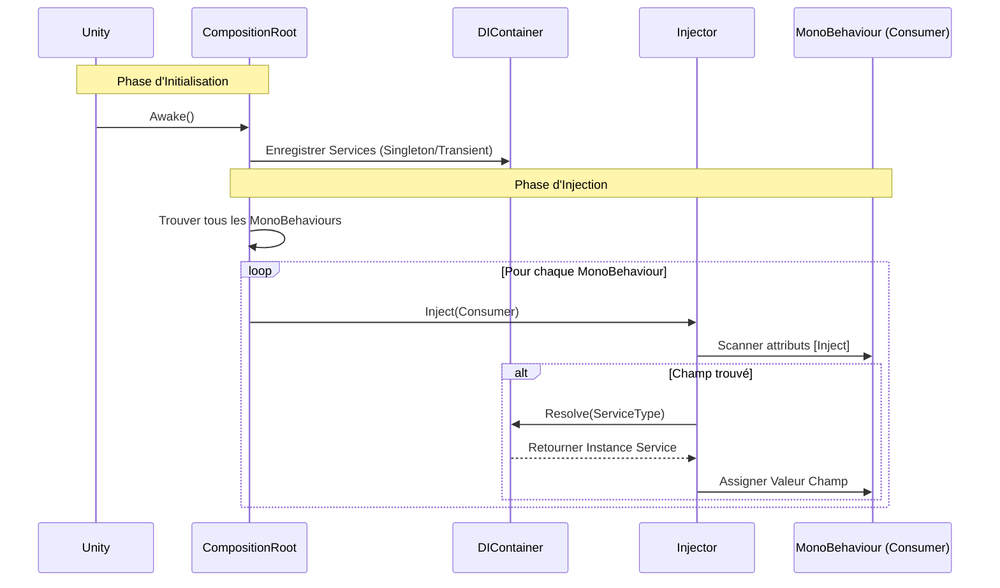

# EthanToolBox [](README.md) [](README.fr.md)

Une boîte à outils légère pour Unity, incluant un système d'Injection de Dépendance simple.

## Installation

Vous pouvez installer ce package directement depuis GitHub via le Unity Package Manager.

1. Ouvrez votre projet Unity.
2. Allez dans **Window > Package Manager**.
3. Cliquez sur l'icône **+** en haut à gauche.
4. Sélectionnez **Add package from git URL...**.
5. Entrez l'URL suivante :
   ```
   https://github.com/EthanDalessandro/EthanToolBox.git?path=/Assets/EthanToolBox
   ```

## Fonctionnalités

### Injection de Dépendance (DI)

Un système DI léger pour gérer les dépendances de votre jeu.

### Comment ça marche



**Démarrage Rapide :**

1. **Configurer DI dans la Scène :**
   - Dans l'éditeur Unity, allez dans **EthanToolBox > Setup DI**.
   - Cela créera automatiquement un GameObject `DICompositionRoot` avec le composant `DefaultCompositionRoot`.

2. **Créer un Service :**
   Ajoutez l'attribut `[Service]` à votre classe.
   ```csharp
   using EthanToolBox.Core.DependencyInjection;

   [Service] // Enregistre automatiquement cette classe
   public class MyService
   {
       public void DoSomething() => Debug.Log("Bonjour !");
   }
   ```

3. **Injecter dans un MonoBehaviour :**
   Ajoutez l'attribut `[Inject]` au champ que vous voulez remplir.
   ```csharp
   public class Player : MonoBehaviour
   {
       [Inject] private MyService _myService;

       private void Start()
       {
           _myService.DoSomething();
       }
   }
   ```

4. **(Optionnel) Installateur Personnalisé :**
   Si vous avez besoin d'une configuration spécifique, vous pouvez hériter de `DICompositionRoot`.
   ```csharp
   public class GameInstaller : DICompositionRoot
   {
       protected override void Configure(DIContainer container)
       {
           // Enregistrement manuel
           // container.RegisterSingleton<OtherService>(new OtherService());
       }
   }
   ```

5. **Injecter dans un MonoBehaviour :**
   Ajoutez l'attribut `[Inject]` au champ que vous voulez remplir.
   ```csharp
   public class Player : MonoBehaviour
   {
       [Inject] private MyService _myService;

       private void Start()
       {
           _myService.DoSomething();
       }
   }
   ```


### Caractéristiques du Système

**Quand utiliser ce système DI ?**
Ce système est conçu pour les **Projets de taille petite à moyenne**, les **Prototypes**, ou le **Développement d'Outils**. Il offre les avantages principaux de l'Injection de Dépendance sans la complexité et le coût en performance des gros frameworks comme Zenject ou VContainer.

**Forces :**
- **Léger :** Impact minimal sur les performances et petite base de code.
- **Simple :** Courbe d'apprentissage très faible. Facile à configurer et déboguer.
- **Pas de Dépendances Externes :** Garde votre projet propre.
- **Explicite :** Vous contrôlez exactement ce qui est enregistré et injecté.

**Faiblesses :**
- **Enregistrement Manuel :** Vous devez enregistrer manuellement les services dans le Composition Root.
- **Fonctionnalités Basiques :** Ne supporte pas les fonctionnalités complexes comme la résolution de dépendances circulaires, les sous-conteneurs, ou les liaisons conditionnelles.
- **Scan de Scène :** L'auto-injection repose sur `FindObjectsByType`, qui peut être lent sur de très grandes scènes avec des milliers de MonoBehaviours (bien que cela puisse être optimisé en injectant manuellement des objets spécifiques).

### Audio Manager (Gestionnaire Audio)

Un système audio professionnel avec pooling, cross-fading et configuration par données.

**Fonctionnalités :**
- **SoundData :** Configurez les sons (volume, pitch, variance, 3D) dans des ScriptableObjects.
- **Pooling :** Réutilisation efficace des AudioSources.
- **Canaux :** Master, Musique, SFX, UI, Voix.
- **Cross-Fading :** Transitions fluides entre les musiques.

**Utilisation :**

1.  **Configuration :**
    - Dans l'éditeur Unity, allez dans **EthanToolBox > Setup Audio Manager**.
    - Cela créera automatiquement un GameObject `AudioManager` dans votre scène s'il n'existe pas déjà.
    - Il est automatiquement enregistré comme service, il est donc prêt à être injecté immédiatement.

2.  **Créer un Sound Data :**
    - Clic droit > **Create > EthanToolBox > Audio > Sound Data**.
    - Assignez les clips et ajustez les réglages (Aléatoire, Spatial Blend, etc.).

3.  **Jouer des Sons :**
    ```csharp
    public class Player : MonoBehaviour
    {
        [Inject] private IAudioManager _audioManager;
        
        public SoundData JumpSound;
        public SoundData MusicTrack;

        public void Jump()
        {
            // Jouer SFX (automatiquement poolé)
            _audioManager.PlaySfx(JumpSound, transform.position);
        }

        public void StartMusic()
        {
            // Jouer Musique avec crossfade de 2s
            _audioManager.PlayMusic(MusicTrack, 2f);
        }
    }
    ```

4.  **Contrôler le Volume :**
    ```csharp
    _audioManager.SetGlobalVolume(AudioChannel.Master, 0.5f);
    _audioManager.SetGlobalVolume(AudioChannel.Music, 0.8f);
    ```

#### 5. Avancé : Intégration Audio Mixer
Pour un contrôle audio professionnel, vous pouvez utiliser l'**Audio Mixer** de Unity.

1.  **Créer un Audio Mixer** dans votre projet (Clic droit > Create > Audio Mixer).
2.  **Créer des Groupes :** Créez des groupes comme Master, Musique, SFX, UI, Voix.
3.  **Assigner dans l'AudioManager :** Sélectionnez le GameObject `AudioManager` dans votre scène.
    - Glissez votre Mixer dans le champ `Audio Mixer`.
    - Glissez vos Groupes spécifiques dans les champs correspondants (`Master Group`, `Music Group`, etc.).
4.  **Override dans SoundData :** Par défaut, les sons jouent sur le groupe de leur canal (ex: `PlaySfx` utilise `SfxGroup`). Vous pouvez surcharger cela par son dans l'asset `SoundData` en assignant un `Mixer Group` spécifique.

### Gestion de Scène (Scene Management)

Un système de gestion de scène simple et compatible async.

**Fonctionnalités :**
- **Chargement Async :** `LoadSceneAsync` avec support `Task`.
- **Groupes de Scènes :** Définissez une collection de scènes (ex: "Niveau 1" + "UI" + "Audio") à charger ensemble via un ScriptableObject.
- **Chargement Additif :** Chargez facilement des scènes par-dessus d'autres.

**Utilisation :**

1. **Enregistrer le Service :**
   ```csharp
   protected override void Configure(DIContainer container)
   {
       container.RegisterSingleton<ISceneLoader>(new SceneLoader());
   }
   ```

2. **Créer un Groupe de Scènes (Optionnel) :**
   - Clic droit dans la vue Projet -> **Create > EthanToolBox > Scene Management > Scene Group**.
   - Ajoutez vos noms de scènes.

3. **Charger des Scènes :**
   ```csharp
   public class MainMenu : MonoBehaviour
   {
       [Inject] private ISceneLoader _sceneLoader;
       public SceneGroup Level1Group;

       public async void OnPlayButtonClicked()
       {
           // Charger une seule scène
           await _sceneLoader.LoadSceneAsync("Lobby");

           // OU Charger un groupe de scènes
           await _sceneLoader.LoadSceneGroupAsync(Level1Group);
   }
   ```

### Bus d'Événements (Event Bus)

Un Bus d'Événements typé pour une communication découplée entre les systèmes.

**Fonctionnalités :**
- **Typé :** Utilise des structs comme signaux d'événements.
- **Découplé :** Les émetteurs et les abonnés n'ont pas besoin de se connaître.
- **Performance :** Utilise l'invocation directe de délégués.

**Utilisation :**

1. **Définir un Événement :**
   ```csharp
   public struct PlayerDiedEvent
   {
       public int PlayerId;
   }
   ```

2. **Enregistrer le Bus d'Événements :**
   ```csharp
   protected override void Configure(DIContainer container)
   {
       container.RegisterSingleton<IEventBus>(new EventBus());
   }
   ```

3. **S'abonner et Émettre :**
   ```csharp
   public class GameManager : MonoBehaviour
   {
       [Inject] private IEventBus _eventBus;

       private void Start()
       {
           _eventBus.Subscribe<PlayerDiedEvent>(OnPlayerDied);
       }

       private void OnDestroy()
       {
           _eventBus.Unsubscribe<PlayerDiedEvent>(OnPlayerDied);
       }

       private void OnPlayerDied(PlayerDiedEvent evt)
       {
           Debug.Log($"Le joueur {evt.PlayerId} est mort !");
       }
   }

   public class PlayerHealth : MonoBehaviour
   {
       [Inject] private IEventBus _eventBus;

   }
   ```

### Object Pooling

Un système générique pour recycler les objets et améliorer les performances.

**Utilisation :**
```csharp
// 1. Créer un Pool
private ObjectPool<Bullet> _bulletPool;

void Awake()
{
    _bulletPool = new ObjectPool<Bullet>(bulletPrefab, 10, transform);
}

// 2. Récupérer un objet
Bullet bullet = _bulletPool.Get();

// 3. Le retourner plus tard
_bulletPool.Return(bullet);
```

### Outils UI (UI Tools)
 
> [!IMPORTANT]
> **TextMeshPro Requis** : Ces outils génèrent de l'UI utilisant TextMeshPro. Assurez-vous que le package TextMeshPro est installé et que les "TMP Essentials" sont importés dans votre projet.

**Générateur de Smart List View :**
Clic droit dans la Hiérarchie -> `EthanToolBox > UI > Smart List View`.
Crée une ScrollView prête à l'emploi avec `VerticalLayoutGroup` et `ContentSizeFitter` pré-configurés.

**Générateurs Avancés :**
- **Main Menu :** Génère un menu complet avec logique Jouer/Quitter.
- **Pause Menu :** Génère un écran de pause avec logique Reprendre/Quitter.
- **Settings Panel :** Génère des réglages de Volume et Qualité avec sauvegarde auto.
- **Loading Screen :** Génère un écran de chargement avec barre de progression.
 
### Extensions

Raccourcis utiles pour le code de tous les jours.

> [!NOTE]
> N'oubliez pas d'ajouter `using EthanToolBox.Core.Extensions;` à votre script !

#### Transform
- `t.Reset()` : Réinitialise position, rotation et échelle.
- `t.DestroyChildren()` : Détruit tous les enfants.
- `t.DestroyChildrenImmediate()` : Détruit tous les enfants immédiatement (Éditeur).
- `t.LookAt2D(target)` : Pivote pour regarder la cible (2D).
- `t.SetPositionX(x)`, `t.SetPositionY(y)`, `t.SetPositionZ(z)` : Définit les axes de position individuels.
- `t.SetLocalScale(scale)` : Définit une échelle uniforme.

#### Vector3
- `v.WithX(x)`, `v.WithY(y)`, `v.WithZ(z)` : Retourne un vecteur avec l'axe modifié.
- `v.AddX(x)`, `v.AddY(y)`, `v.AddZ(z)` : Retourne un vecteur avec la valeur ajoutée à l'axe.
- `v.Flat()` : Retourne un vecteur avec Y = 0.
- `v.DirectionTo(target)` : Retourne la direction normalisée vers la cible.
- `v.DistanceTo(target)` : Retourne la distance vers la cible.
- `v.Closest(list)` : Retourne le vecteur le plus proche d'une liste.

#### Vector2
- `v.WithX(x)`, `v.WithY(y)` : Retourne un vecteur avec l'axe modifié.
- `v.DirectionTo(target)` : Retourne la direction normalisée vers la cible.
- `v.DistanceTo(target)` : Retourne la distance vers la cible.

#### GameObject
- `go.GetOrAddComponent<T>()` : Récupère le composant ou l'ajoute s'il manque.
- `go.HasComponent<T>()` : Vérifie si le composant existe.
- `go.Show()` : Active l'objet.
- `go.Hide()` : Désactive l'objet.
- `go.SetLayerRecursive(layer)` : Définit le layer pour l'objet et ses enfants.

#### Collections (List/Array)
- `list.IsNullOrEmpty()` : Vérifie si null ou vide.
- `list.GetRandom()` : Retourne un élément aléatoire.
- `list.Shuffle()` : Mélange la liste (Fisher-Yates).
- `list.AddUnique(item)` : Ajoute l'élément seulement s'il n'est pas présent.
- `list.ForEach(action)` : Exécute une action sur chaque élément.

#### Math
- `val.Remap(min1, max1, min2, max2)` : Remappe une valeur entre des plages.
- `val.Snap(interval)` : "Snap" la valeur à l'intervalle le plus proche.
- `val.ToPercent()` : Formate un float 0-1 en "XX%".
- `val.SecondsToFormattedString()` : Formate des secondes en "MM:SS".
- `int.IsEven()`, `int.IsOdd()` : Vérifie la parité.

#### String
- `text.Color(color)` : Formate pour la Console Unity (Rich Text).
- `text.Bold()`, `text.Italic()` : Formate le style.
- `text.Truncate(length)` : Coupe la chaîne si trop longue.
- `text.ToInt()`, `text.ToFloat()` : Parsing sécurisé.

#### Color
- `c.WithAlpha(a)` : Retourne une couleur avec l'alpha modifié.
- `c.WithRed(r)`, `c.WithGreen(g)`, `c.WithBlue(b)` : Retourne une couleur avec le canal modifié.
- `c.ToHex()` : Retourne une chaîne hex (ex: "#FF0000").

#### UI (RectTransform)
- `rt.SetWidth(w)`, `rt.SetHeight(h)` : Définit les dimensions.
- `rt.SetSize(w, h)` : Définit le size delta.
- `rt.SetAnchor(x, y)` : Définit les ancres min/max.
- `rt.SetPivot(x, y)` : Définit le pivot.

#### Physics (Rigidbody)
- `rb.Stop()` : Met la vélocité et la vélocité angulaire à zéro.

#### MonoBehaviour
- `this.Delay(seconds, action)` : Exécute une action après un délai.

#### LayerMask
- `mask.Contains(layer)` : Vérifie si le layer est dans le masque.


### Dictionnaire Sérialisable (Serializable Dictionary)

Un wrapper pour rendre les Dictionnaires visibles et éditables dans l'Inspecteur.

**Utilisation :**
Remplacez votre `Dictionary` standard par `ESerializableDictionary`.

```csharp
using EthanToolBox.Core.Extensions;

public class Inventory : MonoBehaviour
{
    // Ceci apparaîtra dans l'Inspecteur !
    public ESerializableDictionary<string, int> Items;
}
```

> [!NOTE]
> Unity ne peut pas sérialiser les types `Dictionary<K,V>` standards. Vous **devez** utiliser `ESerializableDictionary<K,V>` pour qu'il s'affiche dans l'Inspecteur.


## Prérequis

- Unity 2021.3 ou supérieur.
