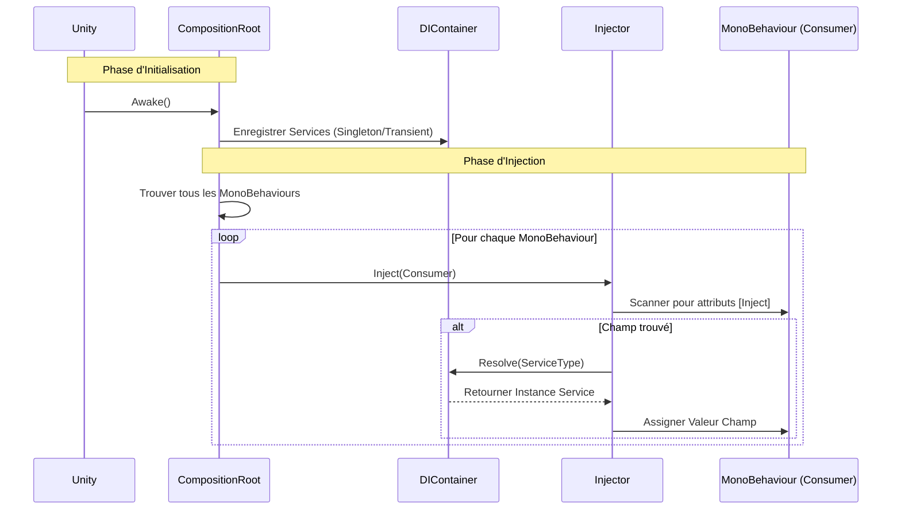

# EthanToolBox [](README.md) [](README.fr.md)

Une boîte à outils légère pour Unity, incluant un système simple d'Injection de Dépendance.

## Installation

Vous pouvez installer ce package directement depuis GitHub via le Unity Package Manager.

1. Ouvrez votre projet Unity.
2. Allez dans **Window > Package Manager**.
3. Cliquez sur l'icône **+** en haut à gauche.
4. Sélectionnez **Add package from git URL...**.
5. Entrez l'URL suivante :
   ```
   https://github.com/EthanDalessandro/EthanToolBox.git?path=/Assets/EthanToolBox
   ```

## Fonctionnalités

### Injection de Dépendance (Dependency Injection)

Un système DI léger pour gérer les dépendances de votre jeu.

### Comment ça marche



**Démarrage Rapide :**

1. **Créer un Service :**
   ```csharp
   public class MyService
   {
       public void DoSomething() => Debug.Log("Bonjour !");
   }
   ```

2. **Créer un Installateur (Composition Root) :**
   Créez un script héritant de `CompositionRoot` et attachez-le à un GameObject dans votre scène.
   ```csharp
   using EthanToolBox.Core.DependencyInjection;

   public class GameInstaller : DICompositionRoot
   {
       protected override void Configure(DIContainer container)
       {
           container.RegisterSingleton<MyService>(new MyService());
       }
   }
   ```

3. **Injecter dans un MonoBehaviour :**
   Ajoutez l'attribut `[Inject]` à n'importe quel champ que vous souhaitez remplir.
   ```csharp
   public class Player : MonoBehaviour
   {
       [Inject] private MyService _myService;

       private void Start()
       {
           _myService.DoSomething();
       }
   }
   ```


### Caractéristiques du Système

**Quand utiliser ce système DI ?**
Ce système est conçu pour les **Petits à Moyens projets**, les **Prototypes**, ou le **Développement d'Outils**. Il offre les avantages principaux de l'Injection de Dépendance sans la complexité et le coût de performance des gros frameworks comme Zenject ou VContainer.

**Points Forts :**
- **Léger :** Impact minimal sur les performances et petite base de code.
- **Simple :** Courbe d'apprentissage très faible. Facile à configurer et à déboguer.
- **Pas de Dépendances Externes :** Garde votre projet propre.
- **Explicite :** Vous contrôlez exactement ce qui est enregistré et injecté.

**Points Faibles :**
- **Enregistrement Manuel :** Vous devez enregistrer manuellement les services dans le Composition Root.
- **Fonctionnalités Basiques :** Ne supporte pas les fonctionnalités complexes comme la résolution de dépendances circulaires, les sous-conteneurs, ou les liaisons conditionnelles.
- **Scan de Scène :** L'auto-injection repose sur `FindObjectsByType`, ce qui peut être lent sur de très grosses scènes avec des milliers de MonoBehaviours (bien que cela puisse être optimisé en injectant manuellement des objets spécifiques).

### Gestion de Scène (Scene Management)

Un système de gestion de scène simple et compatible asynchrone.

**Fonctionnalités :**
- **Chargement Asynchrone :** `LoadSceneAsync` avec support des `Task`.
- **Groupes de Scènes :** Définissez une collection de scènes (ex: "Niveau 1" + "UI" + "Audio") à charger ensemble via un ScriptableObject.
- **Chargement Additif :** Chargez facilement des scènes par-dessus d'autres.

**Utilisation :**

1. **Enregistrer le Service :**
   ```csharp
   protected override void Configure(DIContainer container)
   {
       container.RegisterSingleton<ISceneLoader>(new SceneLoader());
   }
   ```

2. **Créer un Groupe de Scènes (Optionnel) :**
   - Clic droit dans la vue Projet -> **Create > EthanToolBox > Scene Management > Scene Group**.
   - Ajoutez vos noms de scènes.

3. **Charger des Scènes :**
   ```csharp
   public class MainMenu : MonoBehaviour
   {
       [Inject] private ISceneLoader _sceneLoader;
       public SceneGroup Level1Group;

       public async void OnPlayButtonClicked()
       {
           // Charger une seule scène
           await _sceneLoader.LoadSceneAsync("Lobby");

           // OU Charger un groupe de scènes
           await _sceneLoader.LoadSceneGroupAsync(Level1Group);
       }
   }
   ```

### Bus d'Événements (Event Bus)

Un Bus d'Événements typé pour une communication découplée entre les systèmes.

**Fonctionnalités :**
- **Typé (Type-Safe) :** Utilise des structs comme signaux d'événements.
- **Découplé :** Les émetteurs et les abonnés n'ont pas besoin de se connaître.
- **Performance :** Utilise l'invocation directe de délégués.

**Utilisation :**

1. **Définir un Événement :**
   ```csharp
   public struct PlayerDiedEvent
   {
       public int PlayerId;
   }
   ```

2. **Enregistrer le Bus d'Événements :**
   ```csharp
   protected override void Configure(DIContainer container)
   {
       container.RegisterSingleton<IEventBus>(new EventBus());
   }
   ```

3. **S'abonner et Émettre :**
   ```csharp
   public class GameManager : MonoBehaviour
   {
       [Inject] private IEventBus _eventBus;

       private void Start()
       {
           _eventBus.Subscribe<PlayerDiedEvent>(OnPlayerDied);
       }

       private void OnDestroy()
       {
           _eventBus.Unsubscribe<PlayerDiedEvent>(OnPlayerDied);
       }

       private void OnPlayerDied(PlayerDiedEvent evt)
       {
           Debug.Log($"Le joueur {evt.PlayerId} est mort !");
       }
   }

   public class PlayerHealth : MonoBehaviour
   {
       [Inject] private IEventBus _eventBus;

       public void Die()
       {
           _eventBus.Raise(new PlayerDiedEvent { PlayerId = 1 });
       }
   }
   ```

## Prérequis

- Unity 2021.3 ou supérieur.
