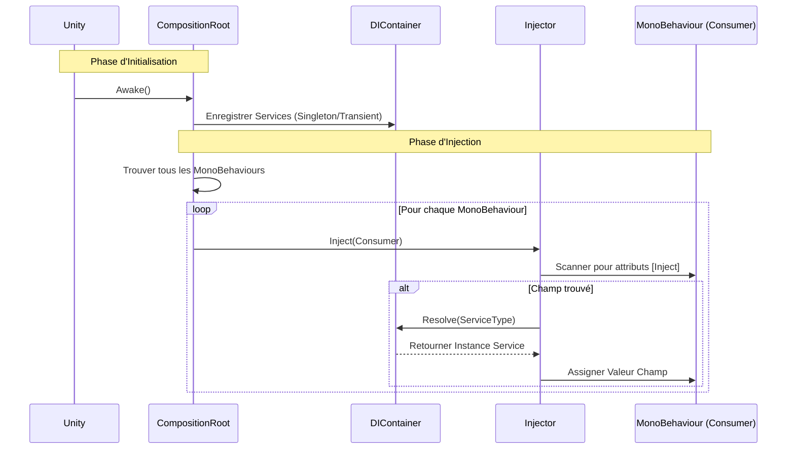

# EthanToolBox [](README.md) [](README.fr.md)

Une boîte à outils légère pour Unity, incluant un système simple d'Injection de Dépendance.

## Installation

Vous pouvez installer ce package directement depuis GitHub via le Unity Package Manager.

1. Ouvrez votre projet Unity.
2. Allez dans **Window > Package Manager**.
3. Cliquez sur l'icône **+** en haut à gauche.
4. Sélectionnez **Add package from git URL...**.
5. Entrez l'URL suivante :
   ```
   https://github.com/EthanDalessandro/EthanToolBox.git?path=/Assets/EthanToolBox
   ```

## Fonctionnalités

### Injection de Dépendance (Dependency Injection)

Un système DI léger pour gérer les dépendances de votre jeu.

### Comment ça marche



**Démarrage Rapide :**

1. **Configurer le DI dans la Scène :**
   - Dans l'éditeur Unity, allez dans **EthanToolBox > Setup DI**.
   - Cela créera automatiquement un GameObject `DICompositionRoot` avec le composant `DefaultCompositionRoot`.

2. **Créer un Service :**
   Ajoutez l'attribut `[Service]` à votre classe.
   ```csharp
   using EthanToolBox.Core.DependencyInjection;

   [Service] // Enregistre automatiquement cette classe
   public class MyService
   {
       public void DoSomething() => Debug.Log("Bonjour !");
   }
   ```

3. **Injecter dans un MonoBehaviour :**
   Ajoutez l'attribut `[Inject]` à n'importe quel champ que vous souhaitez remplir.
   ```csharp
   public class Player : MonoBehaviour
   {
       [Inject] private MyService _myService;

       private void Start()
       {
           _myService.DoSomething();
       }
   }
   ```

4. **(Optionnel) Installateur Personnalisé :**
   Si vous avez besoin d'une configuration spécifique, vous pouvez toujours hériter de `DICompositionRoot`.
   ```csharp
   public class GameInstaller : DICompositionRoot
   {
       protected override void Configure(DIContainer container)
       {
           // Enregistrement manuel
           // container.RegisterSingleton<AutreService>(new AutreService());
       }
   }
   ```

5. **Injecter dans un MonoBehaviour :**
   Ajoutez l'attribut `[Inject]` à n'importe quel champ que vous souhaitez remplir.
   ```csharp
   public class Player : MonoBehaviour
   {
       [Inject] private MyService _myService;

       private void Start()
       {
           _myService.DoSomething();
       }
   }
   ```


### Caractéristiques du Système

**Quand utiliser ce système DI ?**
Ce système est conçu pour les **Petits à Moyens projets**, les **Prototypes**, ou le **Développement d'Outils**. Il offre les avantages principaux de l'Injection de Dépendance sans la complexité et le coût de performance des gros frameworks comme Zenject ou VContainer.

**Points Forts :**
- **Léger :** Impact minimal sur les performances et petite base de code.
- **Simple :** Courbe d'apprentissage très faible. Facile à configurer et à déboguer.
- **Pas de Dépendances Externes :** Garde votre projet propre.
- **Explicite :** Vous contrôlez exactement ce qui est enregistré et injecté.

**Points Faibles :**
- **Enregistrement Manuel :** Vous devez enregistrer manuellement les services dans le Composition Root.
- **Fonctionnalités Basiques :** Ne supporte pas les fonctionnalités complexes comme la résolution de dépendances circulaires, les sous-conteneurs, ou les liaisons conditionnelles.
- **Scan de Scène :** L'auto-injection repose sur `FindObjectsByType`, ce qui peut être lent sur de très grosses scènes avec des milliers de MonoBehaviours (bien que cela puisse être optimisé en injectant manuellement des objets spécifiques).

### Gestion de Scène (Scene Management)

Un système de gestion de scène simple et compatible asynchrone.

**Fonctionnalités :**
- **Chargement Asynchrone :** `LoadSceneAsync` avec support des `Task`.
- **Groupes de Scènes :** Définissez une collection de scènes (ex: "Niveau 1" + "UI" + "Audio") à charger ensemble via un ScriptableObject.
- **Chargement Additif :** Chargez facilement des scènes par-dessus d'autres.

**Utilisation :**

1. **Enregistrer le Service :**
   ```csharp
   protected override void Configure(DIContainer container)
   {
       container.RegisterSingleton<ISceneLoader>(new SceneLoader());
   }
   ```

2. **Créer un Groupe de Scènes (Optionnel) :**
   - Clic droit dans la vue Projet -> **Create > EthanToolBox > Scene Management > Scene Group**.
   - Ajoutez vos noms de scènes.

3. **Charger des Scènes :**
   ```csharp
   public class MainMenu : MonoBehaviour
   {
       [Inject] private ISceneLoader _sceneLoader;
       public SceneGroup Level1Group;

       public async void OnPlayButtonClicked()
       {
           // Charger une seule scène
           await _sceneLoader.LoadSceneAsync("Lobby");

           // OU Charger un groupe de scènes
           await _sceneLoader.LoadSceneGroupAsync(Level1Group);
       }
   }
   ```

### Bus d'Événements (Event Bus)

Un Bus d'Événements typé pour une communication découplée entre les systèmes.

**Fonctionnalités :**
- **Typé (Type-Safe) :** Utilise des structs comme signaux d'événements.
- **Découplé :** Les émetteurs et les abonnés n'ont pas besoin de se connaître.
- **Performance :** Utilise l'invocation directe de délégués.

**Utilisation :**

1. **Définir un Événement :**
   ```csharp
   public struct PlayerDiedEvent
   {
       public int PlayerId;
   }
   ```

2. **Enregistrer le Bus d'Événements :**
   ```csharp
   protected override void Configure(DIContainer container)
   {
       container.RegisterSingleton<IEventBus>(new EventBus());
   }
   ```

3. **S'abonner et Émettre :**
   ```csharp
   public class GameManager : MonoBehaviour
   {
       [Inject] private IEventBus _eventBus;

       private void Start()
       {
           _eventBus.Subscribe<PlayerDiedEvent>(OnPlayerDied);
       }

       private void OnDestroy()
       {
           _eventBus.Unsubscribe<PlayerDiedEvent>(OnPlayerDied);
       }

       private void OnPlayerDied(PlayerDiedEvent evt)
       {
           Debug.Log($"Le joueur {evt.PlayerId} est mort !");
       }
   }

   public class PlayerHealth : MonoBehaviour
   {
       [Inject] private IEventBus _eventBus;

   }
   ```

### Object Pooling (Piscine d'Objets)

Un système générique pour recycler les objets et améliorer les performances.

**Utilisation :**
```csharp
// 1. Créer une Piscine
private ObjectPool<Bullet> _bulletPool;

void Awake()
{
    _bulletPool = new ObjectPool<Bullet>(bulletPrefab, 10, transform);
}

// 2. Récupérer un objet
Bullet bullet = _bulletPool.Get();

// 3. Le rendre plus tard
_bulletPool.Return(bullet);
```

### Audio Manager (Gestionnaire Audio)

Un système audio professionnel incluant pooling, cross-fading, et un workflow basé sur les données avec `SoundData`.

**Fonctionnalités Clés :**
- **Basé sur les Données :** Tous les réglages (volume, pitch, 3D, aléatoire) sont stockés dans des assets `SoundData`, pas dans le code.
- **Pooling :** Recycle automatiquement les composants `AudioSource` pour économiser les performances.
- **Canaux :** Support natif pour les canaux Master, Musique, SFX, UI, et Voix.
- **Transitions Musicales :** Cross-fading fluide entre les pistes.

**Guide Étape par Étape :**

#### 1. Configuration
1.  Dans l'éditeur Unity, allez dans **EthanToolBox > Setup Audio Manager**.
2.  Cela créera automatiquement un GameObject `AudioManager` dans votre scène s'il n'existe pas déjà.
3.  Il est automatiquement enregistré comme service, il est donc prêt à être injecté immédiatement.

#### 2. Créer un Sound Data
Au lieu d'utiliser des `AudioClip` bruts, vous créez des assets `SoundData`.
1.  Clic droit dans la **Fenêtre Projet**.
2.  Allez dans **Create > EthanToolBox > Audio > Sound Data**.
3.  Nommez le fichier (ex: `Sfx_Jump` ou `Music_Battle`).
4.  **Réglages dans l'Inspecteur :**
    - **Clips :** Glissez vos clips audio ici. Si plusieurs sont ajoutés, un sera choisi au hasard.
    - **Volume/Pitch :** Définissez les valeurs de base.
    - **Randomization :** Ajoutez de la variance pour rendre les sons naturels (ex: Volume Variance 0.1, Pitch Variance 0.1).
    - **Spatial Blend :** Mettez à **0 pour 2D** (UI/Musique) ou **1 pour 3D** (Sons du monde).

#### 3. Jouer des Sons dans le Code
Injectez `IAudioManager` et exposez des champs pour `SoundData`.

```csharp
using UnityEngine;
using EthanToolBox.Core.DependencyInjection;
using EthanToolBox.Core.Audio;

public class PlayerAudio : MonoBehaviour
{
    [Inject] private IAudioManager _audioManager;

    [Header("Assets Audio")]
    public SoundData JumpSound;       // Assignez 'Sfx_Jump' ici
    public SoundData FootstepSound;   // Assignez 'Sfx_Footstep' ici
    public SoundData BackgroundMusic; // Assignez 'Music_Battle' ici

    private void Start()
    {
        // Jouer la musique avec une transition de 2 secondes
        _audioManager.PlayMusic(BackgroundMusic, 2f);
    }

    public void PlayJump()
    {
        // Jouer le son à la position du joueur (important pour les sons 3D)
        _audioManager.PlaySfx(JumpSound, transform.position);
    }

    public void PlayFootstep()
    {
        // Jouer le son
        _audioManager.PlaySfx(FootstepSound, transform.position);
    }
}
```

#### 4. Contrôle du Volume Global
Vous pouvez contrôler le volume pour des canaux spécifiques (ex: pour un menu d'options).
```csharp
// Mettre le volume Master à 50%
_audioManager.SetGlobalVolume(AudioChannel.Master, 0.5f);

// Couper la Musique
_audioManager.SetGlobalVolume(AudioChannel.Music, 0f);
```

### Outils UI (UI Tools)
 
> [!IMPORTANT]
> **TextMeshPro Requis** : Ces outils génèrent une UI utilisant TextMeshPro. Assurez-vous que le package TextMeshPro est installé et que les "TMP Essentials" sont importés.

**Générateur de Liste Intelligente (Smart List View) :**
Clic droit dans la Hiérarchie -> `EthanToolBox > UI > Smart List View`.
Crée une ScrollView prête à l'emploi avec `VerticalLayoutGroup` et `ContentSizeFitter` pré-configurés.

**Générateurs Avancés :**
- **Main Menu :** Génère un menu complet avec logique Jouer/Quitter.
- **Pause Menu :** Génère un écran de pause avec logique Reprendre/Quitter.
- **Settings Panel :** Génère les réglages Volume/Qualité avec sauvegarde auto.
- **Loading Screen :** Génère un écran de chargement avec barre de progression.
 
### Extensions

Des raccourcis utiles pour le code de tous les jours.

> [!NOTE]
> N'oubliez pas d'ajouter `using EthanToolBox.Core.Extensions;` dans votre script !

#### Transform
- `t.Reset()` : Réinitialise position, rotation et échelle.
- `t.DestroyChildren()` : Détruit tous les enfants.
- `t.DestroyChildrenImmediate()` : Détruit tous les enfants immédiatement (Éditeur).
- `t.LookAt2D(target)` : Regarde vers la cible (2D).
- `t.SetPositionX(x)`, `t.SetPositionY(y)`, `t.SetPositionZ(z)` : Modifie un axe de position.
- `t.SetLocalScale(scale)` : Définit une échelle uniforme.

#### Vector3
- `v.WithX(x)`, `v.WithY(y)`, `v.WithZ(z)` : Retourne un vecteur avec un axe modifié.
- `v.AddX(x)`, `v.AddY(y)`, `v.AddZ(z)` : Ajoute une valeur à un axe.
- `v.Flat()` : Retourne le vecteur avec Y = 0.
- `v.DirectionTo(target)` : Retourne la direction normalisée vers la cible.
- `v.DistanceTo(target)` : Retourne la distance vers la cible.
- `v.Closest(list)` : Retourne le vecteur le plus proche dans une liste.

#### Vector2
- `v.WithX(x)`, `v.WithY(y)` : Retourne un vecteur avec un axe modifié.
- `v.DirectionTo(target)` : Retourne la direction normalisée vers la cible.
- `v.DistanceTo(target)` : Retourne la distance vers la cible.

#### GameObject
- `go.GetOrAddComponent<T>()` : Récupère ou ajoute le composant.
- `go.HasComponent<T>()` : Vérifie si le composant existe.
- `go.Show()` : Active le GameObject.
- `go.Hide()` : Désactive le GameObject.
- `go.SetLayerRecursive(layer)` : Change le layer de l'objet et ses enfants.

#### Collections (List/Array)
- `list.IsNullOrEmpty()` : Vérifie si null ou vide.
- `list.GetRandom()` : Retourne un élément aléatoire.
- `list.Shuffle()` : Mélange la liste.
- `list.AddUnique(item)` : Ajoute l'élément seulement s'il n'est pas déjà présent.
- `list.ForEach(action)` : Exécute une action sur chaque élément.

#### Math
- `val.Remap(min1, max1, min2, max2)` : Remappe une valeur entre deux plages.
- `val.Snap(interval)` : Arrondit à l'intervalle le plus proche.
- `val.ToPercent()` : Formate 0-1 en "XX%".
- `val.SecondsToFormattedString()` : Formate les secondes en "MM:SS".
- `int.IsEven()`, `int.IsOdd()` : Vérifie la parité.

#### String
- `text.Color(color)` : Formate pour la Console Unity (Rich Text).
- `text.Bold()`, `text.Italic()` : Formate le style.
- `text.Truncate(length)` : Coupe le texte s'il est trop long.
- `text.ToInt()`, `text.ToFloat()` : Parsing sécurisé.

#### Color
- `c.WithAlpha(a)` : Retourne la couleur avec alpha modifié.
- `c.WithRed(r)`, `c.WithGreen(g)`, `c.WithBlue(b)` : Retourne la couleur avec canal modifié.
- `c.ToHex()` : Retourne le code hex (ex: "#FF0000").

#### UI (RectTransform)
- `rt.SetWidth(w)`, `rt.SetHeight(h)` : Définit les dimensions.
- `rt.SetSize(w, h)` : Définit la taille (sizeDelta).
- `rt.SetAnchor(x, y)` : Définit les ancres.
- `rt.SetPivot(x, y)` : Définit le pivot.

#### Physique (Rigidbody)
- `rb.Stop()` : Met la vélocité à zéro.

#### MonoBehaviour
- `this.Delay(seconds, action)` : Exécute une action après un délai.

#### LayerMask
- `mask.Contains(layer)` : Vérifie si le layer est dans le masque.


### Dictionnaire Sérialisable (Serializable Dictionary)

Un wrapper pour rendre les Dictionnaires visibles et éditables dans l'Inspecteur.

**Utilisation :**
Remplacez votre `Dictionary` standard par `ESerializableDictionary`.

```csharp
using EthanToolBox.Core.Extensions;

public class Inventory : MonoBehaviour
{
    // Ceci apparaîtra dans l'Inspecteur !
    public ESerializableDictionary<string, int> Items;
}
```

> [!NOTE]
> Unity ne peut pas sérialiser les types `Dictionary<K,V>` standards. Vous **devez** utiliser `ESerializableDictionary<K,V>` pour qu'il s'affiche dans l'Inspecteur.


## Prérequis

- Unity 2021.3 ou supérieur.
