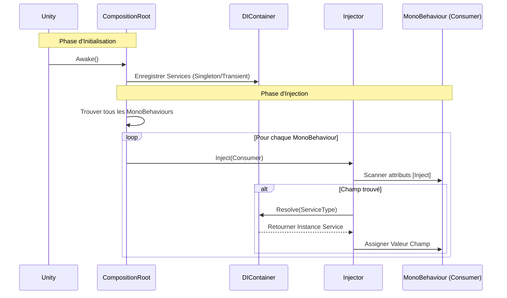

# EthanToolBox [](README.md) [](README.fr.md)

Une boîte à outils légère pour Unity, incluant un système d'Injection de Dépendance simple.

## Installation

Vous pouvez installer ce package directement depuis GitHub via le Unity Package Manager.

1. Ouvrez votre projet Unity.
2. Allez dans **Window > Package Manager**.
3. Cliquez sur l'icône **+** en haut à gauche.
4. Sélectionnez **Add package from git URL...**.
5. Entrez l'URL suivante :
   ```
   https://github.com/EthanDalessandro/EthanToolBox.git?path=/Assets/EthanToolBox
   ```

## Fonctionnalités

### Injection de Dépendance (DI)

Un système DI léger pour gérer les dépendances de votre jeu.

### Comment ça marche



**Démarrage Rapide :**

1. **Configurer DI dans la Scène :**
   - Dans l'éditeur Unity, allez dans **EthanToolBox > Setup DI**.
   - Cela créera automatiquement un GameObject `DICompositionRoot` avec le composant `DefaultCompositionRoot`.

2. **Créer un Service :**
   Ajoutez l'attribut `[Service]` à votre classe.
   ```csharp
   using EthanToolBox.Core.DependencyInjection;

   [Service] // Enregistre automatiquement cette classe
   public class MyService
   {
       public void DoSomething() => Debug.Log("Bonjour !");
   }
   ```

3. **Injecter dans un MonoBehaviour :**
   Ajoutez l'attribut `[Inject]` au champ que vous voulez remplir.
   ```csharp
   public class Player : MonoBehaviour
   {
       [Inject] private MyService _myService;

       private void Start()
       {
           _myService.DoSomething();
       }
   }
   ```

4. **(Optionnel) Installateur Personnalisé :**
   Si vous avez besoin d'une configuration spécifique, vous pouvez hériter de `DICompositionRoot`.
   ```csharp
   public class GameInstaller : DICompositionRoot
   {
       protected override void Configure(DIContainer container)
       {
           // Enregistrement manuel
           // container.RegisterSingleton<OtherService>(new OtherService());
       }
   }
   ```

5. **Injecter dans un MonoBehaviour :**
   Ajoutez l'attribut `[Inject]` au champ que vous voulez remplir.
   ```csharp
   public class Player : MonoBehaviour
   {
       [Inject] private MyService _myService;

       private void Start()
       {
           _myService.DoSomething();
       }
   }
   ```


### Caractéristiques du Système

**Quand utiliser ce système DI ?**
Ce système est conçu pour les **Projets de taille petite à moyenne**, les **Prototypes**, ou le **Développement d'Outils**. Il offre les avantages principaux de l'Injection de Dépendance sans la complexité et le coût en performance des gros frameworks comme Zenject ou VContainer.

**Forces :**
- **Léger :** Impact minimal sur les performances et petite base de code.
- **Simple :** Courbe d'apprentissage très faible. Facile à configurer et déboguer.
- **Pas de Dépendances Externes :** Garde votre projet propre.
- **Explicite :** Vous contrôlez exactement ce qui est enregistré et injecté.

**Faiblesses :**
- **Enregistrement Manuel :** Vous devez enregistrer manuellement les services dans le Composition Root.
- **Fonctionnalités Basiques :** Ne supporte pas les fonctionnalités complexes comme la résolution de dépendances circulaires, les sous-conteneurs, ou les liaisons conditionnelles.
- **Scan de Scène :** L'auto-injection repose sur `FindObjectsByType`, qui peut être lent sur de très grandes scènes avec des milliers de MonoBehaviours (bien que cela puisse être optimisé en injectant manuellement des objets spécifiques).

### Audio Manager (Gestionnaire Audio)

Un système audio professionnel avec pooling, cross-fading et configuration par données.

**Fonctionnalités :**
- **SoundData :** Configurez les sons (volume, pitch, variance, 3D) dans des ScriptableObjects.
- **Pooling :** Réutilisation efficace des AudioSources.
- **Canaux :** Master, Musique, SFX, UI, Voix.
- **Cross-Fading :** Transitions fluides entre les musiques.

**Utilisation :**

1.  **Configuration :**
    - Dans l'éditeur Unity, allez dans **EthanToolBox > Setup Audio Manager**.
    - Cela créera automatiquement un GameObject `AudioManager` dans votre scène s'il n'existe pas déjà.
    - Il est automatiquement enregistré comme service, il est donc prêt à être injecté immédiatement.

2.  **Créer un Sound Data :**
    - Clic droit > **Create > EthanToolBox > Audio > Sound Data**.
    - Assignez les clips et ajustez les réglages (Aléatoire, Spatial Blend, etc.).

3.  **Jouer des Sons :**
    ```csharp
    public class Player : MonoBehaviour
    {
        [Inject] private IAudioManager _audioManager;
        
        public SoundData JumpSound;
        public SoundData MusicTrack;

        public void Jump()
        {
            // Jouer SFX (automatiquement poolé)
            _audioManager.PlaySfx(JumpSound, transform.position);
        }

        public void StartMusic()
        {
            // Jouer Musique avec crossfade de 2s
            _audioManager.PlayMusic(MusicTrack, 2f);
        }
    }
    ```

4.  **Contrôler le Volume :**
    ```csharp
    _audioManager.SetGlobalVolume(AudioChannel.Master, 0.5f);
    _audioManager.SetGlobalVolume(AudioChannel.Music, 0.8f);
    ```

#### 5. Avancé : Intégration Audio Mixer
Pour un contrôle audio professionnel, vous pouvez utiliser l'**Audio Mixer** de Unity.

1.  **Créer un Audio Mixer** dans votre projet (Clic droit > Create > Audio Mixer).
2.  **Créer des Groupes :** Créez des groupes comme Master, Musique, SFX, UI, Voix.
3.  **Assigner dans l'AudioManager :** Sélectionnez le GameObject `AudioManager` dans votre scène.
    - Glissez votre Mixer dans le champ `Audio Mixer`.
    - Glissez vos Groupes spécifiques dans les champs correspondants (`Master Group`, `Music Group`, etc.).
4.  **Override dans SoundData :** Par défaut, les sons jouent sur le groupe de leur canal (ex: `PlaySfx` utilise `SfxGroup`). Vous pouvez surcharger cela par son dans l'asset `SoundData` en assignant un `Mixer Group` spécifique.

### Gestion de Scène (Scene Management)

Un système de gestion de scène propre et professionnel.

**Fonctionnalités :**
- **Groupes de Scènes :** Définissez une collection de scènes à charger ensemble via un ScriptableObject.
- **Drag & Drop :** Utilisez `SceneReference` pour glisser-déposer des scènes directement dans l'Inspecteur.
- **Chargement Synchrone :** API simple pour charger des scènes et des groupes.

**Utilisation :**

1. **Configurer le Scene Manager :**
   - Dans l'éditeur Unity, allez dans **EthanToolBox > Setup Scene Manager**.
   - Cela crée un GameObject `SceneManager` avec le composant `SceneLoader`.

2. **Créer un Groupe de Scènes :**
   - Clic droit dans la vue Projet -> **Create > EthanToolBox > Scene Management > Scene Group**.
   - Glissez et déposez vos assets de scène dans la liste `Scenes`.

3. **Charger des Scènes :**
   ```csharp
   public class MainMenu : MonoBehaviour
   {
       [Inject] private ISceneLoader _sceneLoader;
       public SceneGroup Level1Group;

       public void OnPlayButtonClicked()
       {
           // Charger un groupe de scènes
           _sceneLoader.LoadSceneGroup(Level1Group);
       }
   }
   ```


### Scene Switcher Toolbar

Un menu déroulant pratique dans la barre d'outils de l'éditeur Unity (à côté du bouton Play) pour changer rapidement de scène.

**Fonctionnalités :**
- Liste toutes les scènes du projet.
- Respecte la hiérarchie des dossiers.
- Demande de sauvegarder les changements avant de changer.


## Prérequis

- Unity 2021.3 ou supérieur.
