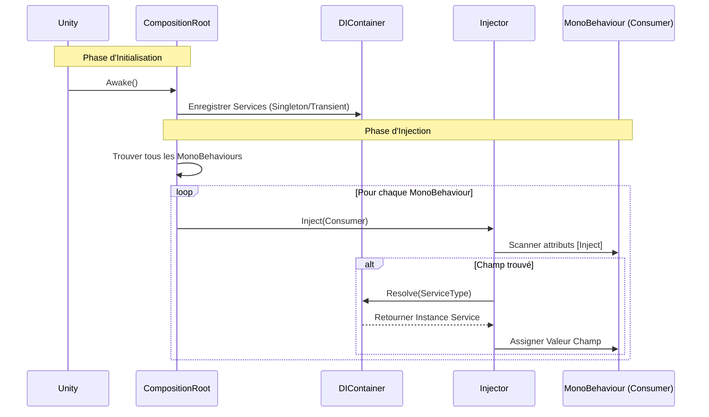

# EthanToolBox [](README.md) [](README.fr.md)

Une boîte à outils légère pour Unity, incluant un système d'Injection de Dépendance simple.

## Installation

Vous pouvez installer ce package directement depuis GitHub via le Unity Package Manager.

1. Ouvrez votre projet Unity.
2. Allez dans **Window > Package Manager**.
3. Cliquez sur l'icône **+** en haut à gauche.
4. Sélectionnez **Add package from git URL...**.
5. Entrez l'URL suivante :
   ```
   https://github.com/EthanDalessandro/EthanToolBox.git?path=/Assets/EthanToolBox
   ```

## Fonctionnalités

### Injection de Dépendance (DI)

Un système DI léger pour gérer les dépendances de votre jeu.

### Comment ça marche



**Démarrage Rapide :**

1. **Configurer DI dans la Scène :**
   - Dans l'éditeur Unity, allez dans **EthanToolBox > Injection > Setup DI**.
   - Cela créera automatiquement un GameObject `DICompositionRoot` avec le composant `DefaultCompositionRoot`.

2. **Créer un Service :**
   Ajoutez l'attribut `[Service]` à votre classe.
   ```csharp
   using EthanToolBox.Core.DependencyInjection;

   [Service] // Enregistre automatiquement cette classe
   public class MyService
   {
       public void DoSomething() => Debug.Log("Bonjour !");
   }
   ```

3. **Injecter dans un MonoBehaviour :**
   Ajoutez l'attribut `[Inject]` au champ que vous voulez remplir.
   ```csharp
   public class Player : MonoBehaviour
   {
       [Inject] private MyService _myService;

       private void Start()
       {
           _myService.DoSomething();
       }
   }
   ```

4. **(Optionnel) Installateur Personnalisé :**
   Si vous avez besoin d'une configuration spécifique, vous pouvez hériter de `DICompositionRoot`.
   ```csharp
   public class GameInstaller : DICompositionRoot
   {
       protected override void Configure(DIContainer container)
       {
           // Enregistrement manuel
           // container.RegisterSingleton<OtherService>(new OtherService());
       }
   }
   ```

5. **Injecter dans un MonoBehaviour :**
   Ajoutez l'attribut `[Inject]` au champ que vous voulez remplir.
   ```csharp
   public class Player : MonoBehaviour
   {
       [Inject] private MyService _myService;

       private void Start()
       {
           _myService.DoSomething();
       }
   }
   ```


### Caractéristiques du Système

**Quand utiliser ce système DI ?**
Ce système est conçu pour les **Projets de taille petite à moyenne**, les **Prototypes**, ou le **Développement d'Outils**. Il offre les avantages principaux de l'Injection de Dépendance sans la complexité et le coût en performance des gros frameworks comme Zenject ou VContainer.

**Forces :**
- **Léger :** Impact minimal sur les performances et petite base de code.
- **Simple :** Courbe d'apprentissage très faible. Facile à configurer et déboguer.
- **Pas de Dépendances Externes :** Garde votre projet propre.
- **Explicite :** Vous contrôlez exactement ce qui est enregistré et injecté.
- **Fonctionnalités Uniques :** Injection optionnelle, InjectAll, et fenêtre de Debug.

**Faiblesses :**
- **Enregistrement Manuel :** Vous devez enregistrer manuellement les services dans le Composition Root.
- **Fonctionnalités Basiques :** Ne supporte pas les fonctionnalités complexes comme la résolution de dépendances circulaires, les sous-conteneurs, ou les liaisons conditionnelles.
- **Scan de Scène :** L'auto-injection repose sur `FindObjectsByType`, qui peut être lent sur de très grandes scènes avec des milliers de MonoBehaviours (bien que cela puisse être optimisé en injectant manuellement des objets spécifiques).

### Fonctionnalités Avancées

#### Injection Optionnelle
Gérez gracieusement les services manquants sans exception :
```csharp
public class Analytics : MonoBehaviour
{
    [Inject(Optional = true)]
    private IAnalyticsService _analytics; // null si non enregistré

    public void Track(string event)
    {
        _analytics?.TrackEvent(event); // Utilisation sécurisée
    }
}
```

#### InjectAll - Injection de Collections
Injectez toutes les instances enregistrées d'un type :
```csharp
public interface IEnemy { void Attack(); }

[Service] public class Zombie : MonoBehaviour, IEnemy { }
[Service] public class Skeleton : MonoBehaviour, IEnemy { }

public class EnemyManager : MonoBehaviour
{
    [InjectAll]
    private List<IEnemy> _allEnemies; // Contient [Zombie, Skeleton]

    public void AttackAll()
    {
        foreach (var enemy in _allEnemies)
            enemy.Attack();
    }
}
```

#### TryResolve & IsRegistered
Vérifiez et résolvez les services de manière sécurisée :
```csharp
// Vérifier si un service existe
if (container.IsRegistered<IAnalytics>())
{
    // Service disponible
}

// Résolution sécurisée sans exception
if (container.TryResolve<ILeaderboard>(out var leaderboard))
{
    leaderboard.SubmitScore(100);
}
```

#### Injection Tardive
Injectez des dépendances dans des objets activés après le démarrage :
```csharp
public class DynamicUI : MonoBehaviour
{
    [Inject] private GameManager _gameManager;

    private void OnEnable()
    {
        // Demander l'injection pour les objets activés après l'initialisation DI
        DICompositionRoot.RequestInjection(this);
    }
}
```

#### Fenêtre de Debug
Une fenêtre Editor stylisée pour visualiser tous les services enregistrés.

**Accès :** `EthanToolBox > Injection > Debug Injection Panel`

**Fonctionnalités :**
- 🎨 **Interface Moderne** : Vue divisée avec liste et inspecteur.
- 🔗 **Graphe de Dépendance** : Visualise les relations "Dépend de" et "Utilisé par".
- ⚡ **Profiler** : Affiche le temps d'initialisation (ms) pour détecter les services lents.
- 🛡️ **Détection de Cycles** : Affiche une ALERTE ROUGE visuelle si une boucle infinie est détectée.
- 🔍 **Inspecteur** : Visualisez les champs publics et lancez des méthodes ("Invoke") directement.
- 📌 **Ping** : Localisez les services MonoBehaviour dans la scène.

#### Optimisation des Performances (Lazy Injection)
Pour les services lourds, utilisez `Lazy<T>` pour différer la création jusqu'au premier usage.

```csharp
public class Player : MonoBehaviour
{
    // Le service n'est PAS créé ici. Démarrage instantané.
    [Inject] private Lazy<ReplaySystem> _replaySystem; 

    public void OnReplay()
    {
        // Le service est créé ICI (une seule fois) lors de l'accès à .Value
        _replaySystem.Value.StartReplay();
    }
}
```

> [!NOTE]
> Toutes les fonctionnalités de debug (Graphe, Profiler, Tracking) sont **supprimées** du Build final (`#if UNITY_EDITOR`). Le jeu compile uniquement la logique d'injection pure pour une performance maximale.

### Audio Manager (Gestionnaire Audio)

Un système audio professionnel avec pooling, cross-fading et configuration par données.

**Fonctionnalités :**
- **SoundData :** Configurez les sons (volume, pitch, variance, 3D) dans des ScriptableObjects.
- **Pooling :** Réutilisation efficace des AudioSources.
- **Canaux :** Master, Musique, SFX, UI, Voix.
- **Cross-Fading :** Transitions fluides entre les musiques.

**Utilisation :**

1.  **Configuration :**
    - Dans l'éditeur Unity, allez dans **EthanToolBox > Setup Audio Manager**.
    - Cela créera automatiquement un GameObject `AudioManager` dans votre scène s'il n'existe pas déjà.
    - Il est automatiquement enregistré comme service, il est donc prêt à être injecté immédiatement.

2.  **Créer un Sound Data :**
    - Clic droit > **Create > EthanToolBox > Audio > Sound Data**.
    - Assignez les clips et ajustez les réglages (Aléatoire, Spatial Blend, etc.).

3.  **Jouer des Sons :**
    ```csharp
    public class Player : MonoBehaviour
    {
        [Inject] private IAudioManager _audioManager;
        
        public SoundData JumpSound;
        public SoundData MusicTrack;

        public void Jump()
        {
            // Jouer SFX (automatiquement poolé)
            _audioManager.PlaySfx(JumpSound, transform.position);
        }

        public void StartMusic()
        {
            // Jouer Musique avec crossfade de 2s
            _audioManager.PlayMusic(MusicTrack, 2f);
        }
    }
    ```

4.  **Contrôler le Volume :**
    ```csharp
    _audioManager.SetGlobalVolume(AudioChannel.Master, 0.5f);
    _audioManager.SetGlobalVolume(AudioChannel.Music, 0.8f);
    ```

#### 5. Avancé : Intégration Audio Mixer
Pour un contrôle audio professionnel, vous pouvez utiliser l'**Audio Mixer** de Unity.

1.  **Créer un Audio Mixer** dans votre projet (Clic droit > Create > Audio Mixer).
2.  **Créer des Groupes :** Créez des groupes comme Master, Musique, SFX, UI, Voix.
3.  **Assigner dans l'AudioManager :** Sélectionnez le GameObject `AudioManager` dans votre scène.
    - Glissez votre Mixer dans le champ `Audio Mixer`.
    - Glissez vos Groupes spécifiques dans les champs correspondants (`Master Group`, `Music Group`, etc.).
4.  **Override dans SoundData :** Par défaut, les sons jouent sur le groupe de leur canal (ex: `PlaySfx` utilise `SfxGroup`). Vous pouvez surcharger cela par son dans l'asset `SoundData` en assignant un `Mixer Group` spécifique.

### Gestion de Scène (Scene Management)

Un système de gestion de scène propre et professionnel.

**Fonctionnalités :**
- **Groupes de Scènes :** Définissez une collection de scènes à charger ensemble via un ScriptableObject.
- **Drag & Drop :** Utilisez `SceneReference` pour glisser-déposer des scènes directement dans l'Inspecteur.
- **Chargement Synchrone :** API simple pour charger des scènes et des groupes.

**Utilisation :**

1. **Configurer le Scene Manager :**
   - Dans l'éditeur Unity, allez dans **EthanToolBox > Setup Scene Manager**.
   - Cela crée un GameObject `SceneManager` avec le composant `SceneLoader`.

2. **Créer un Groupe de Scènes :**
   - Clic droit dans la vue Projet -> **Create > EthanToolBox > Scene Management > Scene Group**.
   - Glissez et déposez vos assets de scène dans la liste `Scenes`.

3. **Charger des Scènes :**
   ```csharp
   public class MainMenu : MonoBehaviour
   {
       [Inject] private ISceneLoader _sceneLoader;
       public SceneGroup Level1Group;

       public void OnPlayButtonClicked()
       {
           // Charger un groupe de scènes
           _sceneLoader.LoadSceneGroup(Level1Group);
       }
   }
   ```


### Scene Switcher Toolbar

Un menu déroulant pratique dans la barre d'outils de l'éditeur Unity (à côté du bouton Play) pour changer rapidement de scène.

**Fonctionnalités :**
- Liste toutes les scènes du projet.
- Respecte la hiérarchie des dossiers.
- Demande de sauvegarder les changements avant de changer.

###- 🟢 Indicateur Live en mode Play

#### 🏭 Factories (Création Dynamique)
Besoin de créer des objets (comme des ennemis) avec leurs dépendances ? Utilisez `Func<T>`.

```csharp
public class Spawner : MonoBehaviour
{
    // Injectez une fonction usine au lieu d'une instance
    [Inject] private Func<Enemy> _enemyFactory; 

    public void SpawnWave()
    {
        // Crée une nouvelle instance d'Enemy avec toutes ses dépendances injectées !
        var newEnemy = _enemyFactory(); 
    }
}
```

#### 📦 Contextes de Scène (Sous-Conteneurs)
Séparez vos **Services Globaux** (Audio, Save) de vos **Services Locaux** (Map, AI).
1. **Global** : Créez un `DICompositionRoot` et cochez `Is Global`. Il persiste entre les scènes.
2. **Local** : Dans n'importe quelle scène, laissez le `DICompositionRoot` (Is Global = Décoché).
3. **Magie** : Les racines locales héritent automatiquement des services globaux. Vos objets peuvent injecter les deux !


#### 🛠️ Outils Professionnels
- **🔍 Analyseur Statique** : `EthanToolBox > Injection > Static Analyzer`. Scanne votre code et vérifie si toutes les injections ont bien un service correspondant **avant** de lancer le jeu.
- **🔥 Hot Swapping** : Dans la fenêtre de Debug, remplacez un service en cours d'exécution par un autre (Drag & Drop -> Swap) pour tester des variantes sans redémarrer.

### 📡 Event Bus (Communication Découplée)
Un système "Radio" ultra-léger pour faire communiquer vos services sans qu'ils se connaissent (Découplage).

**1. Créez un Signal (une simple classe/struct) :**
```csharp
public struct PlayerDamageSignal { public int Amount; }
```

**2. Abonnez-vous (Deux méthodes) :**
```csharp
public class HUD : MonoBehaviour
{
    [Inject] private IEventBus _bus;
    
    private void Start() 
    {
        // Option A : Avec paramètre (si vous voulez les données)
        _bus.Subscribe<PlayerDamageSignal>(OnDamage);
        
        // Option B : Sans paramètre (juste pour savoir que c'est arrivé)
         _bus.Subscribe<PlayerDamageSignal>(OnDamageSimple);
    }

    private void OnDamage(PlayerDamageSignal signal)
    {
        Debug.Log($"Aïe ! Pris {signal.Amount} dégâts.");
    }
    
    private void OnDamageSimple()
    {
         Debug.Log("Aïe ! Je suis touché.");
    }
}
```

**3. Envoyez (Fire) :**
```csharp
public class Player : MonoBehaviour
{
    [Inject] private IEventBus _bus;
    
    public void TakeDamage(int amount)
    {
         _bus.Fire(new PlayerDamageSignal { Amount = amount });
    }
}
```

### Indicateur de Script Hiérarchie

Une aide visuelle dans la fenêtre Hiérarchie pour identifier les objets avec des scripts attachés.

**Fonctionnalités :**
- **Icône de Script :** Affiche une icône de script sur le côté droit de tout GameObject ayant un `MonoBehaviour` personnalisé attaché.
- **Nombre de Scripts :** Si un objet a plusieurs scripts, un chiffre superposé indique le nombre.
- **Infobulle :** Passer la souris sur l'icône affiche les noms de tous les scripts attachés.

### Hierarchy Renamer Overlay (Renommage Hiérarchie)

Un outil de renommage en masse intégré directement dans la fenêtre Hiérarchie.

**Fonctionnalités :**
- **Interface Overlay :** Apparaît automatiquement en bas à droite de la Hiérarchie lorsque plusieurs objets sont sélectionnés.
- **Renommage en masse :** Renommez plusieurs objets avec un préfixe et un index auto-incrémenté.
- **Support Undo :** Totalement réversible avec Ctrl+Z.

### Hierarchy Enhancer (Amélioration Hiérarchie)

Une refonte visuelle de la fenêtre Hiérarchie pour améliorer l'organisation et le workflow.

**Fonctionnalités :**
- **En-têtes :** Renommez n'importe quel GameObject en `[NOM]` (ex: `[SYSTEMES]`) pour créer un séparateur coloré.
- **Toggles Composants :** Icônes alignées à droite pour les composants (Lumières, Caméras, etc.). Cliquez pour les Activer/Désactiver.
- **Gestion des Scripts :**
  - Les scripts standards affichent une icône.
  - Plusieurs scripts sont regroupés en une seule icône. Cliquez pour ouvrir un menu et désactiver des scripts spécifiques.
- **Sélecteur de Layer :** Changez rapidement de Layer directement depuis la ligne de la Hiérarchie.

### Inspector Component Toggler (Toggle Inspecteur)

Une barre utilitaire injectée en haut de l'Inspecteur pour gérer la visibilité des composants.

**Fonctionnalités :**
- **Grille d'icônes :** Affiche les icônes de tous les composants attachés en haut de l'Inspecteur.
- **Visibilité Toggle :** Cliquez sur une icône pour cacher l'interface du composant (le replier complètement) pour gagner de l'espace. Le composant reste actif.
- **Auto-Refresh :** Se met à jour automatiquement lorsque des composants sont ajoutés ou supprimés.


## Prérequis

- Unity 2021.3 ou supérieur.
