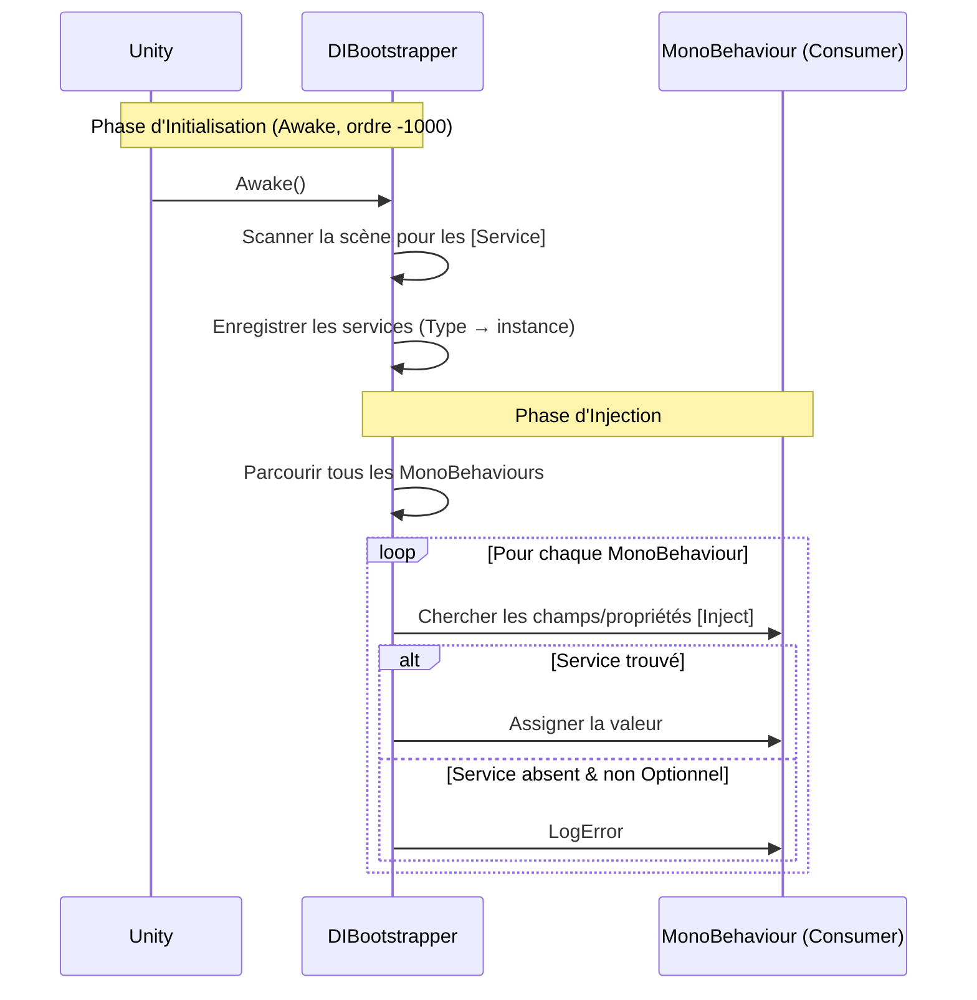

# EthanToolBox [](README.md) [](README.fr.md)

Une boîte à outils légère pour Unity, incluant un système d'Injection de Dépendance simple, un Gestionnaire Audio, une Gestion de Scènes, et des outils éditeur.

## Installation

Vous pouvez installer ce package directement depuis GitHub via le Unity Package Manager.

1. Ouvrez votre projet Unity.
2. Allez dans **Window > Package Manager**.
3. Cliquez sur l'icône **+** en haut à gauche.
4. Sélectionnez **Add package from git URL...**.
5. Entrez l'URL suivante :
   ```
   https://github.com/EthanDalessandro/EthanToolBox.git?path=/Assets/EthanToolBox
   ```

## Fonctionnalités

---

### Injection de Dépendance (DI)

Un système DI léger pour gérer les dépendances de votre jeu sans framework externe.

#### Comment ça marche


```mermaid
sequenceDiagram
    participant Unity
    participant Bootstrapper as DIBootstrapper
    participant Consumer as MonoBehaviour (Consumer)

    Note over Unity, Bootstrapper: Phase d'Initialisation (Awake, ordre -1000)
    Unity->>Bootstrapper: Awake()
    Bootstrapper->>Bootstrapper: Scanner la scène pour les [Service]
    Bootstrapper->>Bootstrapper: Enregistrer les services (Type → instance)

    Note over Bootstrapper, Consumer: Phase d'Injection
    Bootstrapper->>Bootstrapper: Parcourir tous les MonoBehaviours
    loop Pour chaque MonoBehaviour
        Bootstrapper->>Consumer: Chercher les champs/propriétés [Inject]
        alt Service trouvé
            Bootstrapper->>Consumer: Assigner la valeur
        else Service absent & non Optionnel
            Bootstrapper->>Consumer: LogError
        end
    end
```

#### Démarrage Rapide

1. **Configurer DI dans la Scène :**
   - Dans l'éditeur Unity, allez dans **EthanToolBox > Injection > Setup DI**.
   - Cela crée un GameObject `DIBootstrapper` dans votre scène.

2. **Créer un Service :**
   Ajoutez l'attribut `[Service]` à votre MonoBehaviour.
   ```csharp
   using EthanToolBox.Core.DependencyInjection;

   [Service] // Enregistre automatiquement ce MonoBehaviour
   public class MyService : MonoBehaviour
   {
       public void DoSomething() => Debug.Log("Bonjour !");
   }
   ```

3. **Enregistrer sous une Interface :**
   Passez le type d'interface à `[Service]` pour l'enregistrer par interface.
   ```csharp
   [Service(typeof(IMyService))]
   public class MyService : MonoBehaviour, IMyService { }
   ```

4. **Injecter dans un MonoBehaviour :**
   Ajoutez `[Inject]` à tout champ ou propriété que vous souhaitez remplir.
   ```csharp
   public class Player : MonoBehaviour
   {
       [Inject] private IMyService _myService;

       private void Start()
       {
           _myService.DoSomething();
       }
   }
   ```

#### Injection Optionnelle

Gérez les services manquants sans erreur :
```csharp
public class Analytics : MonoBehaviour
{
    [Inject(Optional = true)]
    private IAnalyticsService _analytics; // null si non enregistré — aucune erreur

    public void Track(string eventName)
    {
        _analytics?.TrackEvent(eventName);
    }
}
```

#### Caractéristiques du Système

**Quand utiliser ce système DI ?**
Conçu pour les **projets de taille petite à moyenne**, les **prototypes**, ou le **développement d'outils**. Il offre les avantages principaux de l'Injection de Dépendance sans la complexité de gros frameworks comme Zenject ou VContainer.

**Forces :**
- **Léger :** Impact minimal sur les performances et petite base de code.
- **Simple :** Courbe d'apprentissage très faible. Facile à configurer et déboguer.
- **Pas de Dépendances Externes :** Garde votre projet propre.
- **Explicite :** Vous contrôlez exactement ce qui est enregistré et injecté.
- **Support d'Interfaces :** Enregistrez une classe concrète sous un type d'interface.
- **Injection Optionnelle :** Les champs peuvent être ignorés silencieusement si le service est absent.

**Faiblesses :**
- **MonoBehaviour uniquement :** Les services doivent être des composants `MonoBehaviour` présents dans la scène au démarrage.
- **Fonctionnalités Basiques :** Pas de résolution de dépendances circulaires, sous-conteneurs, ou liaisons conditionnelles.
- **Scan de Scène :** L'auto-injection utilise `FindObjectsByType`, qui peut être lent sur de très grandes scènes.

---

### Gestionnaire Audio (Audio Manager)

Un système audio professionnel avec pooling, cross-fading, et une configuration par données via `SoundData`.

**Fonctionnalités :**
- **Data-Driven :** Tous les réglages audio (volume, pitch, 3D blend, variance) sont stockés dans des `SoundData` ScriptableObjects.
- **Pooling :** Réutilisation automatique des `AudioSource` pour économiser les performances.
- **Canaux :** Support intégré pour Master, Musique, SFX, UI, et Voix.
- **Transitions Musicales :** Cross-fading fluide entre les pistes via un double AudioSource.

#### 1. Configuration
1. Dans l'éditeur Unity, allez dans **EthanToolBox > Setup Audio Manager**.
2. Cela crée un GameObject `AudioManager` dans votre scène s'il n'existe pas déjà.
3. Il est automatiquement enregistré comme service DI (`IAudioManager`), prêt à être injecté.

#### 2. Créer un Sound Data
Au lieu d'utiliser des `AudioClip` bruts, créez des assets `SoundData`.
1. Clic droit dans la **Project Window**.
2. Allez dans **Create > EthanToolBox > Audio > Sound Data**.
3. Nommez le fichier (ex: `Sfx_Jump` ou `Music_Battle`).
4. **Réglages Inspector :**
   - **Clips :** Glissez vos clips audio. Si plusieurs sont ajoutés, un est choisi aléatoirement.
   - **Volume / Pitch :** Définissez les valeurs de base.
   - **Randomisation :** Ajoutez de la variance pour des sons plus naturels (ex: Volume Variance `0.1`).
   - **Spatial Blend :** `0` pour 2D (UI/Musique) ou `1` pour 3D (sons du monde).

#### 3. Jouer des Sons
```csharp
using UnityEngine;
using EthanToolBox.Core.DependencyInjection;
using EthanToolBox.Core.Audio;

public class PlayerAudio : MonoBehaviour
{
    [Inject] private IAudioManager _audioManager;

    [Header("Audio Assets")]
    public SoundData JumpSound;
    public SoundData BackgroundMusic;

    private void Start()
    {
        // Jouer la musique avec un crossfade de 2 secondes
        _audioManager.PlayMusic(BackgroundMusic, 2f);
    }

    public void PlayJump()
    {
        // Jouer SFX à la position du joueur (important pour les sons 3D)
        _audioManager.PlaySfx(JumpSound, transform.position);
    }
}
```

#### 4. Contrôle du Volume Global
```csharp
// Régler le volume Master à 50%
_audioManager.SetGlobalVolume(AudioChannel.Master, 0.5f);

// Couper la Musique
_audioManager.SetGlobalVolume(AudioChannel.Music, 0f);
```

#### 5. Intégration Audio Mixer
Pour un contrôle audio professionnel, utilisez l'Audio Mixer de Unity.

1. **Créer un Audio Mixer** (Clic droit > Create > Audio Mixer).
2. **Créer des Groupes :** Master, Musique, SFX, UI, Voix.
3. **Assigner dans l'AudioManager :** Sélectionnez le GameObject `AudioManager` et glissez votre Mixer et vos Groupes dans les champs correspondants.
4. **Override dans SoundData :** Surchargez le groupe de mixer par son en assignant un `Mixer Group` spécifique dans l'asset `SoundData`.

---

### Gestion de Scène (Scene Management)

Un système de gestion de scènes propre et type-safe.

**Fonctionnalités :**
- **Groupes de Scènes :** Définissez une collection de scènes à charger ensemble via un ScriptableObject.
- **Drag & Drop :** Utilisez `SceneReference` pour glisser des scènes directement dans l'Inspecteur — sans noms de scènes en string.
- **Chargement Asynchrone :** La première scène du groupe se charge en Single, les suivantes en Additive.

#### Utilisation

1. **Configurer le Scene Manager :**
   - Allez dans **EthanToolBox > Setup Scene Manager**.
   - Cela crée un GameObject `SceneLoader` enregistré comme `ISceneLoader`.

2. **Créer un Groupe de Scènes :**
   - Clic droit dans la vue Projet → **Create > EthanToolBox > Scene Management > Scene Group**.
   - Glissez vos assets de scène dans la liste `Scenes`.

3. **Charger des Scènes :**
   ```csharp
   public class MainMenu : MonoBehaviour
   {
       [Inject] private ISceneLoader _sceneLoader;
       public SceneGroup Level1Group;

       public void OnPlayButtonClicked()
       {
           _sceneLoader.LoadSceneGroup(Level1Group);
       }
   }
   ```

---

### Outils Éditeur

#### Scene Switcher Toolbar

Un menu déroulant dans la barre d'outils de l'éditeur Unity (à côté du bouton Play) pour changer rapidement de scène.

- Liste toutes les scènes du projet, en respectant la hiérarchie des dossiers.
- Demande de sauvegarder les changements avant de changer.

#### Hierarchy Enhancer

Une refonte visuelle de la fenêtre Hiérarchie.

- **En-têtes :** Nommez un GameObject `[NOM]` (ex: `[SYSTEMES]`) pour créer un séparateur coloré.
- **Icônes Composants :** Icônes colorées alignées à droite pour les composants courants (Caméra, Lumière, Audio, etc.). Cliquez pour les activer/désactiver.
- **Gestion des Scripts :** Les scripts personnalisés affichent une icône. Plusieurs scripts sont regroupés en une icône avec un menu pour les activer individuellement.
- **Sélecteur de Layer :** Changez de layer directement depuis la ligne de la Hiérarchie.

**Activer via :** `EthanToolBox > Hierarchy > [Tree Lines | Full | Compact] Mode`

#### Hierarchy Renamer Overlay

Un outil de renommage en masse intégré dans la fenêtre Hiérarchie.

- **Interface Overlay :** Apparaît automatiquement en bas à droite de la Hiérarchie quand plusieurs GameObjects sont sélectionnés.
- **Renommage en Masse :** Renommez avec un préfixe et un index auto-incrémenté.
- **Support Undo :** Totalement réversible avec Ctrl+Z.

#### Inspector Component Toggler

Une barre utilitaire injectée en haut de l'Inspecteur pour gérer la visibilité des composants.

- **Grille d'Icônes :** Affiche les icônes de tous les composants attachés en haut de l'Inspecteur.
- **Toggle Visibilité :** Cliquez sur une icône pour replier l'interface d'un composant (le composant reste actif).
- **Auto-Refresh :** Se met à jour automatiquement lorsque des composants sont ajoutés ou supprimés.

#### Raccourci Mode Play

Un raccourci clavier configurable (défaut : F1) pour basculer en mode Play et maximiser la Game View.

**Configurer via :** `EthanToolBox > Shortcuts > Configure Shortcut`

---

## Prérequis

- Unity 6 (6000.1.2f1) ou supérieur.
