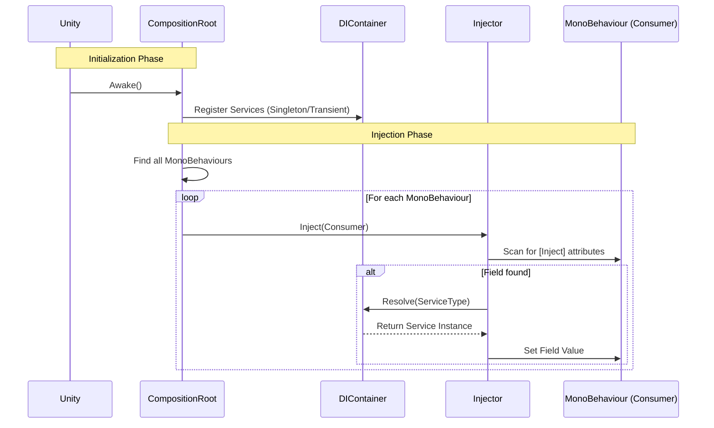

# EthanToolBox [](README.md) [](README.fr.md)

A lightweight utility toolbox for Unity, featuring a simple Dependency Injection system.

## Installation

You can install this package directly from GitHub via the Unity Package Manager.

1. Open your Unity Project.
2. Go to **Window > Package Manager**.
3. Click the **+** icon in the top-left corner.
4. Select **Add package from git URL...**.
5. Enter the following URL:
   ```
   https://github.com/EthanDalessandro/EthanToolBox.git?path=/Assets/EthanToolBox
   ```

## Features

### Dependency Injection

A lightweight DI system to manage your game's dependencies.


### How it Works



**Quick Start:**

1. **Create a Service:**
   ```csharp
   public class MyService
   {
       public void DoSomething() => Debug.Log("Hello!");
   }
   ```

2. **Create an Installer (Composition Root):**
   Create a script inheriting from `CompositionRoot` and attach it to a GameObject in your scene.
   ```csharp
   using EthanToolBox.Core.DependencyInjection;

   public class GameInstaller : DICompositionRoot
   {
       protected override void Configure(DIContainer container)
       {
           container.RegisterSingleton<MyService>(new MyService());
       }
   }
   ```

3. **Inject into a MonoBehaviour:**
   Add the `[Inject]` attribute to any field you want to populate.
   ```csharp
   public class Player : MonoBehaviour
   {
       [Inject] private MyService _myService;

       private void Start()
       {
           _myService.DoSomething();
       }
   }
   ```


### System Characteristics

**When to use this DI System?**
This system is designed for **Small to Medium-sized projects**, **Prototypes**, or **Tool Development**. It provides the core benefits of Dependency Injection without the complexity and performance overhead of large frameworks like Zenject or VContainer.

**Strengths:**
- **Lightweight:** Minimal performance impact and small codebase.
- **Simple:** Very low learning curve. Easy to setup and debug.
- **No External Dependencies:** Keeps your project clean.
- **Explicit:** You control exactly what gets registered and injected.

**Weaknesses:**
- **Manual Registration:** You must manually register services in the Composition Root.
- **Basic Features:** Does not support complex features like circular dependency resolution, sub-containers, or conditional bindings.
- **Scene Scanning:** The auto-injection relies on `FindObjectsByType`, which can be slow on very large scenes with thousands of MonoBehaviours (though this can be optimized by manually injecting specific objects).

### Scene Management

A simple async-ready Scene Management system.

**Features:**
- **Async Loading:** `LoadSceneAsync` with `Task` support.
- **Scene Groups:** Define a collection of scenes (e.g., "Level 1" + "UI" + "Audio") to load together via a ScriptableObject.
- **Additive Loading:** Easily load scenes on top of others.

**Usage:**

1. **Register the Service:**
   ```csharp
   protected override void Configure(DIContainer container)
   {
       container.RegisterSingleton<ISceneLoader>(new SceneLoader());
   }
   ```

2. **Create a Scene Group (Optional):**
   - Right-click in Project view -> **Create > EthanToolBox > Scene Management > Scene Group**.
   - Add your scene names.

3. **Load Scenes:**
   ```csharp
   public class MainMenu : MonoBehaviour
   {
       [Inject] private ISceneLoader _sceneLoader;
       public SceneGroup Level1Group;

       public async void OnPlayButtonClicked()
       {
           // Load a single scene
           await _sceneLoader.LoadSceneAsync("Lobby");

           // OR Load a group of scenes
           await _sceneLoader.LoadSceneGroupAsync(Level1Group);
   }
   ```

### Event Bus

A type-safe Event Bus for decoupled communication between systems.

**Features:**
- **Type-Safe:** Uses structs as event signals.
- **Decoupled:** Publishers and subscribers don't need to know about each other.
- **Performance:** Uses direct delegate invocation.

**Usage:**

1. **Define an Event:**
   ```csharp
   public struct PlayerDiedEvent
   {
       public int PlayerId;
   }
   ```

2. **Register the Event Bus:**
   ```csharp
   protected override void Configure(DIContainer container)
   {
       container.RegisterSingleton<IEventBus>(new EventBus());
   }
   ```

3. **Subscribe and Raise:**
   ```csharp
   public class GameManager : MonoBehaviour
   {
       [Inject] private IEventBus _eventBus;

       private void Start()
       {
           _eventBus.Subscribe<PlayerDiedEvent>(OnPlayerDied);
       }

       private void OnDestroy()
       {
           _eventBus.Unsubscribe<PlayerDiedEvent>(OnPlayerDied);
       }

       private void OnPlayerDied(PlayerDiedEvent evt)
       {
           Debug.Log($"Player {evt.PlayerId} died!");
       }
   }

   public class PlayerHealth : MonoBehaviour
   {
       [Inject] private IEventBus _eventBus;

       public void Die()
       {
           _eventBus.Raise(new PlayerDiedEvent { PlayerId = 1 });
       }
   }
   ```

## Requirements

- Unity 2021.3 or higher.
