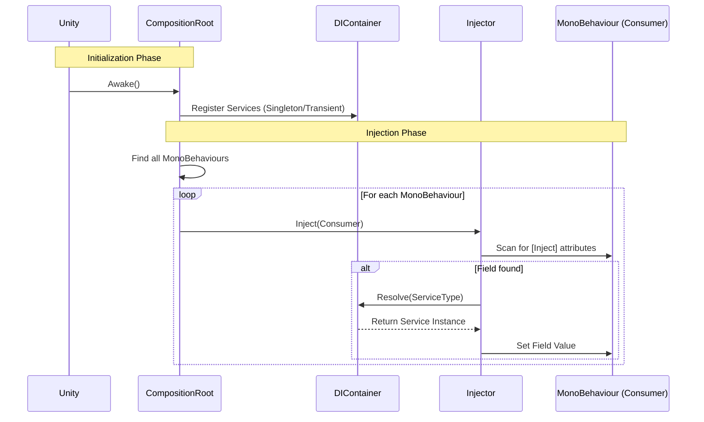

# EthanToolBox [](README.md) [](README.fr.md)

A lightweight utility toolbox for Unity, featuring a simple Dependency Injection system.

## Installation

You can install this package directly from GitHub via the Unity Package Manager.

1. Open your Unity Project.
2. Go to **Window > Package Manager**.
3. Click the **+** icon in the top-left corner.
4. Select **Add package from git URL...**.
5. Enter the following URL:
   ```
   https://github.com/EthanDalessandro/EthanToolBox.git?path=/Assets/EthanToolBox
   ```

## Features

### Dependency Injection

A lightweight DI system to manage your game's dependencies.


### How it Works



**Quick Start:**

1. **Setup DI in Scene:**
   - In the Unity Editor, go to **EthanToolBox > Setup DI**.
   - This will automatically create a `DICompositionRoot` GameObject with the `DefaultCompositionRoot` component.

2. **Create a Service:**
   Add the `[Service]` attribute to your class.
   ```csharp
   using EthanToolBox.Core.DependencyInjection;

   [Service] // Automatically registers this class
   public class MyService
   {
       public void DoSomething() => Debug.Log("Hello!");
   }
   ```

3. **Inject into a MonoBehaviour:**
   Add the `[Inject]` attribute to any field you want to populate.
   ```csharp
   public class Player : MonoBehaviour
   {
       [Inject] private MyService _myService;

       private void Start()
       {
           _myService.DoSomething();
       }
   }
   ```

4. **(Optional) Custom Installer:**
   If you need specific configuration, you can still inherit from `DICompositionRoot`.
   ```csharp
   public class GameInstaller : DICompositionRoot
   {
       protected override void Configure(DIContainer container)
       {
           // Manual registration
           // container.RegisterSingleton<OtherService>(new OtherService());
       }
   }
   ```

5. **Inject into a MonoBehaviour:**
   Add the `[Inject]` attribute to any field you want to populate.
   ```csharp
   public class Player : MonoBehaviour
   {
       [Inject] private MyService _myService;

       private void Start()
       {
           _myService.DoSomething();
       }
   }
   ```


### System Characteristics

**When to use this DI System?**
This system is designed for **Small to Medium-sized projects**, **Prototypes**, or **Tool Development**. It provides the core benefits of Dependency Injection without the complexity and performance overhead of large frameworks like Zenject or VContainer.

**Strengths:**
- **Lightweight:** Minimal performance impact and small codebase.
- **Simple:** Very low learning curve. Easy to setup and debug.
- **No External Dependencies:** Keeps your project clean.
- **Explicit:** You control exactly what gets registered and injected.

**Weaknesses:**
- **Manual Registration:** You must manually register services in the Composition Root.
- **Basic Features:** Does not support complex features like circular dependency resolution, sub-containers, or conditional bindings.
- **Scene Scanning:** The auto-injection relies on `FindObjectsByType`, which can be slow on very large scenes with thousands of MonoBehaviours (though this can be optimized by manually injecting specific objects).

### Scene Management

A simple async-ready Scene Management system.

**Features:**
- **Async Loading:** `LoadSceneAsync` with `Task` support.
- **Scene Groups:** Define a collection of scenes (e.g., "Level 1" + "UI" + "Audio") to load together via a ScriptableObject.
- **Additive Loading:** Easily load scenes on top of others.

**Usage:**

1. **Register the Service:**
   ```csharp
   protected override void Configure(DIContainer container)
   {
       container.RegisterSingleton<ISceneLoader>(new SceneLoader());
   }
   ```

2. **Create a Scene Group (Optional):**
   - Right-click in Project view -> **Create > EthanToolBox > Scene Management > Scene Group**.
   - Add your scene names.

3. **Load Scenes:**
   ```csharp
   public class MainMenu : MonoBehaviour
   {
       [Inject] private ISceneLoader _sceneLoader;
       public SceneGroup Level1Group;

       public async void OnPlayButtonClicked()
       {
           // Load a single scene
           await _sceneLoader.LoadSceneAsync("Lobby");

           // OR Load a group of scenes
           await _sceneLoader.LoadSceneGroupAsync(Level1Group);
   }
   ```

### Event Bus

A type-safe Event Bus for decoupled communication between systems.

**Features:**
- **Type-Safe:** Uses structs as event signals.
- **Decoupled:** Publishers and subscribers don't need to know about each other.
- **Performance:** Uses direct delegate invocation.

**Usage:**

1. **Define an Event:**
   ```csharp
   public struct PlayerDiedEvent
   {
       public int PlayerId;
   }
   ```

2. **Register the Event Bus:**
   ```csharp
   protected override void Configure(DIContainer container)
   {
       container.RegisterSingleton<IEventBus>(new EventBus());
   }
   ```

3. **Subscribe and Raise:**
   ```csharp
   public class GameManager : MonoBehaviour
   {
       [Inject] private IEventBus _eventBus;

       private void Start()
       {
           _eventBus.Subscribe<PlayerDiedEvent>(OnPlayerDied);
       }

       private void OnDestroy()
       {
           _eventBus.Unsubscribe<PlayerDiedEvent>(OnPlayerDied);
       }

       private void OnPlayerDied(PlayerDiedEvent evt)
       {
           Debug.Log($"Player {evt.PlayerId} died!");
       }
   }

   public class PlayerHealth : MonoBehaviour
   {
       [Inject] private IEventBus _eventBus;

   }
   ```

### Object Pooling

A generic system to recycle objects and improve performance.

**Usage:**
```csharp
// 1. Create a Pool
private ObjectPool<Bullet> _bulletPool;

void Awake()
{
    _bulletPool = new ObjectPool<Bullet>(bulletPrefab, 10, transform);
}

// 2. Get an object
Bullet bullet = _bulletPool.Get();

// 3. Return it later
_bulletPool.Return(bullet);
```

### Audio Manager

A professional-grade audio system featuring pooling, cross-fading, and a data-driven workflow using `SoundData`.

**Key Features:**
- **Data-Driven:** All sound settings (volume, pitch, 3D blend, randomization) are stored in `SoundData` assets, not in code.
- **Pooling:** Automatically recycles `AudioSource` components to save performance.
- **Channels:** Built-in support for Master, Music, SFX, UI, and Voice channels.
- **Music Transitions:** Smooth cross-fading between tracks.

**Step-by-Step Guide:**

#### 1. Setup
1.  In the Unity Editor, go to **EthanToolBox > Setup Audio Manager**.
2.  This will automatically create an `AudioManager` GameObject in your scene if one doesn't exist.
3.  It is automatically registered as a service, so it's ready to be injected immediately.

#### 2. Create Sound Data
Instead of using raw `AudioClip`s, you create `SoundData` assets.
1.  Right-click in the **Project Window**.
2.  Go to **Create > EthanToolBox > Audio > Sound Data**.
3.  Name the file (e.g., `Sfx_Jump` or `Music_Battle`).
4.  **Inspector Settings:**
    - **Clips:** Drag your audio clip(s) here. If multiple are added, one will be picked at random.
    - **Volume/Pitch:** Set base values.
    - **Randomization:** Add variance to make sounds feel natural (e.g., Volume Variance 0.1, Pitch Variance 0.1).
    - **Spatial Blend:** Set to **0 for 2D** (UI/Music) or **1 for 3D** (World sounds).

#### 3. Play Sounds in Code
Inject `IAudioManager` and expose fields for `SoundData`.

```csharp
using UnityEngine;
using EthanToolBox.Core.DependencyInjection;
using EthanToolBox.Core.Audio;

public class PlayerAudio : MonoBehaviour
{
    [Inject] private IAudioManager _audioManager;

    [Header("Audio Assets")]
    public SoundData JumpSound;       // Assign 'Sfx_Jump' here
    public SoundData FootstepSound;   // Assign 'Sfx_Footstep' here
    public SoundData BackgroundMusic; // Assign 'Music_Battle' here

    private void Start()
    {
        // Play music with a 2-second crossfade transition
        _audioManager.PlayMusic(BackgroundMusic, 2f);
    }

    public void PlayJump()
    {
        // Play sound at the player's position (important for 3D sounds)
        _audioManager.PlaySfx(JumpSound, transform.position);
    }

    public void PlayFootstep()
    {
        // Play sound attached to the player (optional logic)
        _audioManager.PlaySfx(FootstepSound, transform.position);
    }
}
```

#### 4. Global Volume Control
You can control volume for specific channels (e.g., for a Settings menu).
```csharp
// Set Master volume to 50%
_audioManager.SetGlobalVolume(AudioChannel.Master, 0.5f);

// Mute Music
_audioManager.SetGlobalVolume(AudioChannel.Music, 0f);
```

### UI Tools
 
> [!IMPORTANT]
> **TextMeshPro Required**: These tools generate UI using TextMeshPro. Ensure the TextMeshPro package is installed and "TMP Essentials" are imported in your project.

**Smart List View Generator:**
Right-click in Hierarchy -> `EthanToolBox > UI > Smart List View`.
Creates a ready-to-use ScrollView with `VerticalLayoutGroup` and `ContentSizeFitter` pre-configured.

**Advanced Generators:**
- **Main Menu:** Generates a full menu with Play/Quit logic.
- **Pause Menu:** Generates a pause screen with Resume/Quit logic.
- **Settings Panel:** Generates Volume and Quality settings with auto-save.
- **Loading Screen:** Generates a loading screen with a progress bar.
 
### Extensions

Useful shortcuts for everyday coding.

> [!NOTE]
> Don't forget to add `using EthanToolBox.Core.Extensions;` to your script!

#### Transform
- `t.Reset()`: Resets position, rotation, and scale.
- `t.DestroyChildren()`: Destroys all children.
- `t.DestroyChildrenImmediate()`: Destroys all children immediately (Editor).
- `t.LookAt2D(target)`: Rotates to look at target (2D).
- `t.SetPositionX(x)`, `t.SetPositionY(y)`, `t.SetPositionZ(z)`: Sets individual position axes.
- `t.SetLocalScale(scale)`: Sets uniform scale.

#### Vector3
- `v.WithX(x)`, `v.WithY(y)`, `v.WithZ(z)`: Returns vector with modified axis.
- `v.AddX(x)`, `v.AddY(y)`, `v.AddZ(z)`: Returns vector with added value to axis.
- `v.Flat()`: Returns vector with Y = 0.
- `v.DirectionTo(target)`: Returns normalized direction to target.
- `v.DistanceTo(target)`: Returns distance to target.
- `v.Closest(list)`: Returns the closest vector from a list.

#### Vector2
- `v.WithX(x)`, `v.WithY(y)`: Returns vector with modified axis.
- `v.DirectionTo(target)`: Returns normalized direction to target.
- `v.DistanceTo(target)`: Returns distance to target.

#### GameObject
- `go.GetOrAddComponent<T>()`: Gets component or adds it if missing.
- `go.HasComponent<T>()`: Checks if component exists.
- `go.Show()`: Sets active to true.
- `go.Hide()`: Sets active to false.
- `go.SetLayerRecursive(layer)`: Sets layer for object and children.

#### Collections (List/Array)
- `list.IsNullOrEmpty()`: Checks if null or empty.
- `list.GetRandom()`: Returns a random element.
- `list.Shuffle()`: Randomizes the list (Fisher-Yates).
- `list.AddUnique(item)`: Adds item only if not present.
- `list.ForEach(action)`: Executes action on each element.

#### Math
- `val.Remap(min1, max1, min2, max2)`: Remaps value between ranges.
- `val.Snap(interval)`: Snaps value to nearest interval.
- `val.ToPercent()`: Formats 0-1 float to "XX%".
- `val.SecondsToFormattedString()`: Formats seconds to "MM:SS".
- `int.IsEven()`, `int.IsOdd()`: Checks parity.

#### String
- `text.Color(color)`: Formats for Unity Console (Rich Text).
- `text.Bold()`, `text.Italic()`: Formats style.
- `text.Truncate(length)`: Cuts string if too long.
- `text.ToInt()`, `text.ToFloat()`: Safe parsing.

#### Color
- `c.WithAlpha(a)`: Returns color with modified alpha.
- `c.WithRed(r)`, `c.WithGreen(g)`, `c.WithBlue(b)`: Returns color with modified channel.
- `c.ToHex()`: Returns hex string (e.g., "#FF0000").

#### UI (RectTransform)
- `rt.SetWidth(w)`, `rt.SetHeight(h)`: Sets dimensions.
- `rt.SetSize(w, h)`: Sets size delta.
- `rt.SetAnchor(x, y)`: Sets anchor min/max.
- `rt.SetPivot(x, y)`: Sets pivot.

#### Physics (Rigidbody)
- `rb.Stop()`: Sets velocity and angular velocity to zero.

#### MonoBehaviour
- `this.Delay(seconds, action)`: Executes action after delay.

#### LayerMask
- `mask.Contains(layer)`: Checks if layer is in mask.


### Serializable Dictionary

A wrapper to make Dictionaries visible and editable in the Inspector.

**Usage:**
Replace your standard `Dictionary` with `ESerializableDictionary`.

```csharp
using EthanToolBox.Core.Extensions;

public class Inventory : MonoBehaviour
{
    // This will appear in the Inspector!
    public ESerializableDictionary<string, int> Items;
}
```

> [!NOTE]
> Unity cannot serialize standard `Dictionary<K,V>` types. You **must** use `ESerializableDictionary<K,V>` for it to show up in the Inspector.


## Requirements

- Unity 2021.3 or higher.
