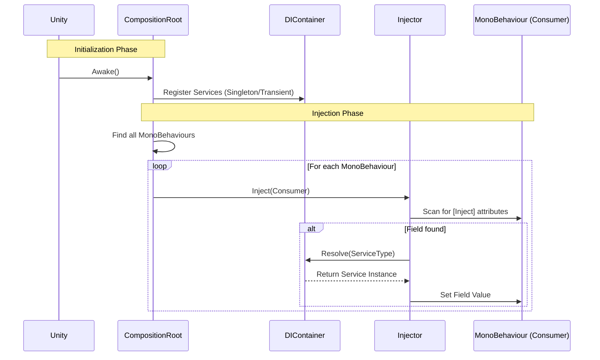

# EthanToolBox [](README.md) [](README.fr.md)

A lightweight utility toolbox for Unity, featuring a simple Dependency Injection system.

## Installation

You can install this package directly from GitHub via the Unity Package Manager.

1. Open your Unity Project.
2. Go to **Window > Package Manager**.
3. Click the **+** icon in the top-left corner.
4. Select **Add package from git URL...**.
5. Enter the following URL:
   ```
   https://github.com/EthanDalessandro/EthanToolBox.git?path=/Assets/EthanToolBox
   ```

## Features

### Dependency Injection

A lightweight DI system to manage your game's dependencies.


### How it Works



**Quick Start:**

1. **Setup DI in Scene:**
   - In the Unity Editor, go to **EthanToolBox > Injection > Setup DI**.
   - This will automatically create a `DICompositionRoot` GameObject with the `DefaultCompositionRoot` component.

2. **Create a Service:**
   Add the `[Service]` attribute to your class.
   ```csharp
   using EthanToolBox.Core.DependencyInjection;

   [Service] // Automatically registers this class
   public class MyService
   {
       public void DoSomething() => Debug.Log("Hello!");
   }
   ```

3. **Inject into a MonoBehaviour:**
   Add the `[Inject]` attribute to any field you want to populate.
   ```csharp
   public class Player : MonoBehaviour
   {
       [Inject] private MyService _myService;

       private void Start()
       {
           _myService.DoSomething();
       }
   }
   ```

4. **(Optional) Custom Installer:**
   If you need specific configuration, you can still inherit from `DICompositionRoot`.
   ```csharp
   public class GameInstaller : DICompositionRoot
   {
       protected override void Configure(DIContainer container)
       {
           // Manual registration
           // container.RegisterSingleton<OtherService>(new OtherService());
       }
   }
   ```


### System Characteristics

**When to use this DI System?**
This system is designed for **Small to Medium-sized projects**, **Prototypes**, or **Tool Development**. It provides the core benefits of Dependency Injection without the complexity and performance overhead of large frameworks like Zenject or VContainer.

**Strengths:**
- **Lightweight:** Minimal performance impact and small codebase.
- **Simple:** Very low learning curve. Easy to setup and debug.
- **No External Dependencies:** Keeps your project clean.
- **Explicit:** You control exactly what gets registered and injected.
- **Unique Features:** Optional injection, InjectAll, and Debug Window.

**Weaknesses:**
- **Manual Registration:** You must manually register services in the Composition Root.
- **Basic Features:** Does not support complex features like circular dependency resolution, sub-containers, or conditional bindings.
- **Scene Scanning:** The auto-injection relies on `FindObjectsByType`, which can be slow on very large scenes with thousands of MonoBehaviours (though this can be optimized by manually injecting specific objects).

### Advanced Features

#### Optional Injection
Gracefully handle missing services without exceptions:
```csharp
public class Analytics : MonoBehaviour
{
    [Inject(Optional = true)]
    private IAnalyticsService _analytics; // null if not registered

    public void Track(string event)
    {
        _analytics?.TrackEvent(event); // Safe to use
    }
}
```

#### InjectAll - Collection Injection
Inject all registered instances of a type:
```csharp
public interface IEnemy { void Attack(); }

[Service] public class Zombie : MonoBehaviour, IEnemy { }
[Service] public class Skeleton : MonoBehaviour, IEnemy { }

public class EnemyManager : MonoBehaviour
{
    [InjectAll]
    private List<IEnemy> _allEnemies; // Contains [Zombie, Skeleton]

    public void AttackAll()
    {
        foreach (var enemy in _allEnemies)
            enemy.Attack();
    }
}
```

#### TryResolve & IsRegistered
Safely check and resolve services:
```csharp
// Check if a service exists
if (container.IsRegistered<IAnalytics>())
{
    // Service is available
}

// Safe resolution without exceptions
if (container.TryResolve<ILeaderboard>(out var leaderboard))
{
    leaderboard.SubmitScore(100);
}
```

#### Late Injection
Inject dependencies into objects activated after startup:
```csharp
public class DynamicUI : MonoBehaviour
{
    [Inject] private GameManager _gameManager;

    private void OnEnable()
    {
        // Request injection for objects activated after DI initialization
        DICompositionRoot.RequestInjection(this);
    }
}
```

#### Debug Window
A stylish Editor window to visualize all registered services.

**Access:** `EthanToolBox > Injection > Debug Injection Panel`

**Features:**
- 🎨 **Modern Interface**: Split view with list and inspector.
- 🔗 **Dependency Graph**: Visualizes "Depends On" and "Used By" relationships.
- ⚡ **Profiler**: Shows initialization time (ms) to detect slow services.
- 🛡️ **Cycle Detection**: Visual RED ALERT if circular dependencies are found.
- 🔍 **Inspector**: View public fields/properties and invoke parameterless methods directly.
- 📌 **Ping**: Locate MonoBehaviour services in the scene.

#### Performance Optimization (Lazy Injection)
For heavy services, use `Lazy<T>` to defer creation until the first access.

```csharp
public class Player : MonoBehaviour
{
    // The service is NOT created here. Instant startup.
    [Inject] private Lazy<HeavyService> _heavyService; 

    public void OpenMenu()
    {
        // The service is created HERE (only once) when using .Value
        _heavyService.Value.Open();
    }
}
```

> [!NOTE]
> All debug features (Graph, Profiler, Tracking) are **stripped** from the build (`#if UNITY_EDITOR`). The build contains only pure, high-performance injection logic.

### Audio Manager

A professional-grade audio system featuring pooling, cross-fading, and a data-driven workflow using `SoundData`.

**Key Features:**
- **Data-Driven:** All sound settings (volume, pitch, 3D blend, randomization) are stored in `SoundData` assets, not in code.
- **Pooling:** Automatically recycles `AudioSource` components to save performance.
- **Channels:** Built-in support for Master, Music, SFX, UI, and Voice channels.
- **Music Transitions:** Smooth cross-fading between tracks.

**Step-by-Step Guide:**

#### 1. Setup
1.  In the Unity Editor, go to **EthanToolBox > Setup Audio Manager**.
2.  This will automatically create an `AudioManager` GameObject in your scene if one doesn't exist.
3.  It is automatically registered as a service, so it's ready to be injected immediately.

#### 2. Create Sound Data
Instead of using raw `AudioClip`s, you create `SoundData` assets.
1.  Right-click in the **Project Window**.
2.  Go to **Create > EthanToolBox > Audio > Sound Data**.
3.  Name the file (e.g., `Sfx_Jump` or `Music_Battle`).
4.  **Inspector Settings:**
    - **Clips:** Drag your audio clip(s) here. If multiple are added, one will be picked at random.
    - **Volume/Pitch:** Set base values.
    - **Randomization:** Add variance to make sounds feel natural (e.g., Volume Variance 0.1, Pitch Variance 0.1).
    - **Spatial Blend:** Set to **0 for 2D** (UI/Music) or **1 for 3D** (World sounds).

#### 3. Play Sounds in Code
Inject `IAudioManager` and expose fields for `SoundData`.

```csharp
using UnityEngine;
using EthanToolBox.Core.DependencyInjection;
using EthanToolBox.Core.Audio;

public class PlayerAudio : MonoBehaviour
{
    [Inject] private IAudioManager _audioManager;

    [Header("Audio Assets")]
    public SoundData JumpSound;       // Assign 'Sfx_Jump' here
    public SoundData FootstepSound;   // Assign 'Sfx_Footstep' here
    public SoundData BackgroundMusic; // Assign 'Music_Battle' here

    private void Start()
    {
        // Play music with a 2-second crossfade transition
        _audioManager.PlayMusic(BackgroundMusic, 2f);
    }

    public void PlayJump()
    {
        // Play sound at the player's position (important for 3D sounds)
        _audioManager.PlaySfx(JumpSound, transform.position);
    }

    public void PlayFootstep()
    {
        // Play sound attached to the player (optional logic)
        _audioManager.PlaySfx(FootstepSound, transform.position);
    }
}
```

#### 4. Global Volume Control
You can control volume for specific channels (e.g., for a Settings menu).
```csharp
// Set Master volume to 50%
_audioManager.SetGlobalVolume(AudioChannel.Master, 0.5f);

// Mute Music
_audioManager.SetGlobalVolume(AudioChannel.Music, 0f);
```

#### 5. Advanced: Audio Mixer Integration
For professional audio control, you can use Unity's **Audio Mixer**.

1.  **Create an Audio Mixer** in your project (Right-click > Create > Audio Mixer).
2.  **Expose Groups:** Create groups like Master, Music, SFX, UI, Voice.
3.  **Assign in AudioManager:** Select the `AudioManager` GameObject in your scene.
    - Drag your Mixer into the `Audio Mixer` field.
    - Drag your specific Groups into the corresponding fields (`Master Group`, `Music Group`, etc.).
4.  **SoundData Override:** By default, sounds play on their channel's group (e.g., `PlaySfx` uses `SfxGroup`). You can override this per-sound in the `SoundData` asset by assigning a specific `Mixer Group`.

### Scene Management

A clean and professional Scene Management system.

**Features:**
- **Scene Groups:** Define a collection of scenes to load together via a ScriptableObject.
- **Drag & Drop:** Use `SceneReference` to drag scenes directly into the Inspector.
- **Synchronous Loading:** Simple API for loading scenes and groups.

**Usage:**

1. **Setup Scene Manager:**
   - In the Unity Editor, go to **EthanToolBox > Setup Scene Manager**.
   - This creates a `SceneManager` GameObject with the `SceneLoader` component.

2. **Create a Scene Group:**
   - Right-click in Project view -> **Create > EthanToolBox > Scene Management > Scene Group**.
   - Drag and drop your scene assets into the `Scenes` list.

3. **Load Scenes:**
   ```csharp
   public class MainMenu : MonoBehaviour
   {
       [Inject] private ISceneLoader _sceneLoader;
       public SceneGroup Level1Group;

       public void OnPlayButtonClicked()
       {
           // Load a group of scenes
           _sceneLoader.LoadSceneGroup(Level1Group);
       }
   }
   ```


### Scene Switcher Toolbar

A handy dropdown in the Unity Editor toolbar (next to the Play button) to quickly switch between scenes.

**Features:**
- Lists all scenes in the project.
- Respects folder hierarchy.
- Prompts to save changes before switching.

#### 🏭 Factories (Dynamic Spawning)
Need to spawn objects (like enemies) with injected dependencies? Use `Func<T>`.

```csharp
public class Spawner : MonoBehaviour
{
    // Inject a factory function instead of an instance
    [Inject] private Func<Enemy> _enemyFactory; 

    public void SpawnWave()
    {
        // Creates a new Enemy instance with all its dependencies injected automatically!
        var newEnemy = _enemyFactory(); 
    }
}
```

#### 📦 Scene Contexts (Sub-Containers)
Separate your **Global Services** (Audio, Save) from **Scene Services** (Map, AI).
1. **Global**: Create a `DICompositionRoot` and check `Is Global`. It persists across scenes.
2. **Local**: In any scene, allow `DICompositionRoot` (Is Global = Unchecked).
3. **Magic**: Local roots automatically inherit services from the Global root. Objects in the scene can inject both!


#### 🛠️ Professional Tools
- **🔍 Static Analyzer**: `EthanToolBox > Injection > Static Analyzer`. Scans your code and matches it against registrations to find missing dependencies **before** you hit Play.


### 🔌 Auto-Inject on Spawn (Prefab Instantiation)
When you spawn a prefab with `Instantiate()`, the new object's scripts are NOT injected. Use `DICompositionRoot.Spawn()` instead.

```csharp
// Old way (No injection!)
var enemy = Instantiate(enemyPrefab);

// New way (Auto-injected + POOLED!)
var enemy = DICompositionRoot.Spawn(enemyPrefab);
```

### 🎱 Object Pooling (Built-in)
Spawn automatically uses object pooling. Just use `Release()` instead of `Destroy()`.

```csharp
// Spawn (from pool if available, else Instantiate)
var bullet = DICompositionRoot.Spawn(bulletPrefab);

// Release (back to pool instead of Destroy)
DICompositionRoot.Release(bullet);

// Optional: Pre-warm the pool at start
DICompositionRoot.Prewarm(bulletPrefab, 50);
```

**Optional Callbacks:** Implement `IPoolable` for reset logic:
```csharp
public class Bullet : MonoBehaviour, IPoolable
{
    public void OnSpawn() { /* Reset state */ }
    public void OnRelease() { /* Cleanup */ }
}
```

### 📡 Event Bus (Decoupled Communication)
A lightweight "Radio" system to let services talk without knowing each other (Decoupling).

**1. Create a Signal (just a class/struct):**
```csharp
public struct PlayerDamageSignal { public int Amount; }
```

**2. Subscribe (Two ways):**
```csharp
public class HUD : MonoBehaviour
{
    [Inject] private IEventBus _bus;
    
    private void Start() 
    {
        // Option A: With parameter (if you need data)
        _bus.Subscribe<PlayerDamageSignal>(OnDamage);
        
        // Option B: No parameter (if you just want to know it happened)
         _bus.Subscribe<PlayerDamageSignal>(OnDamageSimple);
    }

    private void OnDamage(PlayerDamageSignal signal)
    {
        Debug.Log($"Ouch! Took {signal.Amount} damage.");
    }
    
    private void OnDamageSimple()
    {
         Debug.Log("Ouch! I was hit.");
    }
}
```

**3. Fire (Send):**
```csharp
public class Player : MonoBehaviour
{
    [Inject] private IEventBus _bus;
    
    public void TakeDamage(int amount)
    {
         _bus.Fire(new PlayerDamageSignal { Amount = amount });
    }
}
```

### Hierarchy Script Indicator

A visual aid in the Hierarchy window that helps identify objects with attached scripts.

**Features:**
- **Script Icon:** Displays a script icon on the right side of any GameObject that has a custom `MonoBehaviour` attached.
- **Script Count:** If an object has multiple scripts, a number overlay indicates the count.
- **Tooltip:** Hovering over the icon displays the names of all attached scripts.

### Hierarchy Renamer Overlay

A bulk rename tool integrated directly into the Hierarchy window.

**Features:**
- **Overlay UI:** Appears automatically in the bottom-right of the Hierarchy when multiple specific objects are selected.
- **Bulk Rename:** Rename multiple objects with a prefix and auto-incrementing index.
- **Undo Support:** Fully reversible with Ctrl+Z.

### Hierarchy Enhancer

A visual overhaul for the Hierarchy window to improve organization and workflow.

**Features:**
- **Headers:** Rename any GameObject to `[NAME]` (e.g., `[SYSTEMS]`) to create a colored header separator.
- **Component Toggles:** Right-aligned icons for components (Lights, Cameras, etc.). Click to toggle them On/Off.
- **Script Management:** 
  - Standard scripts show an icon. 
  - Multiple scripts are grouped into a single icon. Click to open a menu to toggle specific scripts.
- **Layer Selector:** Quickly switch layers directly from the Hierarchy row.

### Inspector Component Toggler

A utility bar injected at the top of the Inspector window to manage component visibility.

**Features:**
- **Grid Layout:** Displays icons for all attached components at the top of the Inspector.
- **Toggle Visibility:** Click an icon to hide the component's UI (folding it away completely) to save scrolling space. The component remains active.
- **Auto-Refresh:** Automatically updates when components are added or removed.


## Requirements

- Unity 2021.3 or higher.
