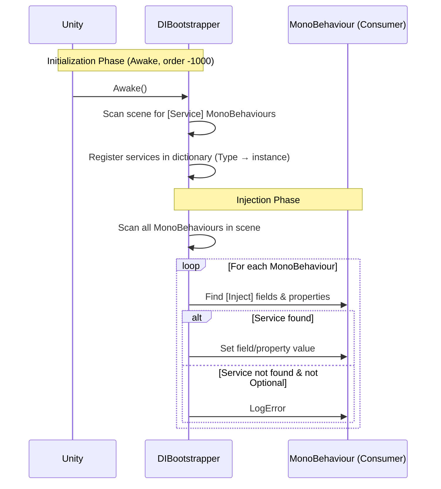

# EthanToolBox [](README.md) [](README.fr.md)

A lightweight utility toolbox for Unity, featuring a simple Dependency Injection system, Audio Manager, Scene Management, and Editor productivity tools.

## Installation

You can install this package directly from GitHub via the Unity Package Manager.

1. Open your Unity Project.
2. Go to **Window > Package Manager**.
3. Click the **+** icon in the top-left corner.
4. Select **Add package from git URL...**.
5. Enter the following URL:
   ```
   https://github.com/EthanDalessandro/EthanToolBox.git?path=/Assets/EthanToolBox
   ```

## Features

---

### Dependency Injection

A lightweight DI system to manage your game's dependencies without external frameworks.

#### How it Works


```mermaid
sequenceDiagram
    participant Unity
    participant Bootstrapper as DIBootstrapper
    participant Consumer as MonoBehaviour (Consumer)

    Note over Unity, Bootstrapper: Initialization Phase (Awake, order -1000)
    Unity->>Bootstrapper: Awake()
    Bootstrapper->>Bootstrapper: Scan scene for [Service] MonoBehaviours
    Bootstrapper->>Bootstrapper: Register services in dictionary (Type → instance)

    Note over Bootstrapper, Consumer: Injection Phase
    Bootstrapper->>Bootstrapper: Scan all MonoBehaviours in scene
    loop For each MonoBehaviour
        Bootstrapper->>Consumer: Find [Inject] fields & properties
        alt Service found
            Bootstrapper->>Consumer: Set field/property value
        else Service not found & not Optional
            Bootstrapper->>Consumer: LogError
        end
    end
```

#### Quick Start

1. **Setup DI in Scene:**
   - In the Unity Editor, go to **EthanToolBox > Injection > Setup DI**.
   - This creates a `DIBootstrapper` GameObject in your scene.

2. **Create a Service:**
   Add the `[Service]` attribute to your MonoBehaviour.
   ```csharp
   using EthanToolBox.Core.DependencyInjection;

   [Service] // Registers this MonoBehaviour automatically
   public class MyService : MonoBehaviour
   {
       public void DoSomething() => Debug.Log("Hello!");
   }
   ```

3. **Register as Interface:**
   Pass the interface type to `[Service]` to register by interface.
   ```csharp
   [Service(typeof(IMyService))]
   public class MyService : MonoBehaviour, IMyService { }
   ```

4. **Inject into a MonoBehaviour:**
   Add `[Inject]` to any field or property you want populated.
   ```csharp
   public class Player : MonoBehaviour
   {
       [Inject] private IMyService _myService;

       private void Start()
       {
           _myService.DoSomething();
       }
   }
   ```

#### Optional Injection

Gracefully handle missing services without errors:
```csharp
public class Analytics : MonoBehaviour
{
    [Inject(Optional = true)]
    private IAnalyticsService _analytics; // null if not registered — no error thrown

    public void Track(string eventName)
    {
        _analytics?.TrackEvent(eventName);
    }
}
```

#### System Characteristics

**When to use this DI System?**
Designed for **small to medium-sized projects**, **prototypes**, or **tool development**. It provides the core benefits of Dependency Injection without the complexity of large frameworks like Zenject or VContainer.

**Strengths:**
- **Lightweight:** Minimal performance impact and small codebase.
- **Simple:** Very low learning curve. Easy to setup and debug.
- **No External Dependencies:** Keeps your project clean.
- **Explicit:** You control exactly what gets registered and injected.
- **Interface Support:** Register a concrete class under an interface type.
- **Optional Injection:** Fields can be silently skipped if a service is missing.

**Weaknesses:**
- **MonoBehaviour only:** Services must be `MonoBehaviour` components present in the scene at startup.
- **Basic Features:** No circular dependency resolution, sub-containers, or conditional bindings.
- **Scene Scanning:** Auto-injection uses `FindObjectsByType`, which can be slow on very large scenes.

---

### Audio Manager

A professional-grade audio system featuring pooling, cross-fading, and a data-driven workflow using `SoundData`.

**Key Features:**
- **Data-Driven:** All sound settings (volume, pitch, 3D blend, randomization) are stored in `SoundData` ScriptableObject assets.
- **Pooling:** Automatically recycles `AudioSource` components to save performance.
- **Channels:** Built-in support for Master, Music, SFX, UI, and Voice channels.
- **Music Transitions:** Smooth cross-fading between tracks using dual audio sources.

#### 1. Setup
1. In the Unity Editor, go to **EthanToolBox > Setup Audio Manager**.
2. This creates an `AudioManager` GameObject in your scene if one doesn't exist.
3. It is automatically registered as a DI service (`IAudioManager`), ready to be injected.

#### 2. Create Sound Data
Instead of using raw `AudioClip`s, create `SoundData` assets.
1. Right-click in the **Project Window**.
2. Go to **Create > EthanToolBox > Audio > Sound Data**.
3. Name the file (e.g., `Sfx_Jump` or `Music_Battle`).
4. **Inspector Settings:**
   - **Clips:** Drag your audio clip(s) here. If multiple are added, one is picked at random.
   - **Volume / Pitch:** Set base values.
   - **Randomization:** Add variance to make sounds feel natural (e.g., Volume Variance `0.1`, Pitch Variance `0.1`).
   - **Spatial Blend:** `0` for 2D (UI/Music) or `1` for 3D (world sounds).

#### 3. Play Sounds in Code
```csharp
using UnityEngine;
using EthanToolBox.Core.DependencyInjection;
using EthanToolBox.Core.Audio;

public class PlayerAudio : MonoBehaviour
{
    [Inject] private IAudioManager _audioManager;

    [Header("Audio Assets")]
    public SoundData JumpSound;
    public SoundData BackgroundMusic;

    private void Start()
    {
        // Play music with a 2-second crossfade
        _audioManager.PlayMusic(BackgroundMusic, 2f);
    }

    public void PlayJump()
    {
        // Play SFX at the player's position (important for 3D sounds)
        _audioManager.PlaySfx(JumpSound, transform.position);
    }
}
```

#### 4. Global Volume Control
```csharp
// Set Master volume to 50%
_audioManager.SetGlobalVolume(AudioChannel.Master, 0.5f);

// Mute Music
_audioManager.SetGlobalVolume(AudioChannel.Music, 0f);
```

#### 5. Audio Mixer Integration
For professional audio control, you can use Unity's Audio Mixer.

1. **Create an Audio Mixer** (Right-click > Create > Audio Mixer).
2. **Create Groups:** Master, Music, SFX, UI, Voice.
3. **Assign in AudioManager:** Select the `AudioManager` GameObject and drag your Mixer and Groups into the corresponding fields.
4. **SoundData Override:** Override the mixer group per-sound by assigning a specific `Mixer Group` in the `SoundData` asset.

---

### Scene Management

A clean and type-safe Scene Management system.

**Features:**
- **Scene Groups:** Define a collection of scenes to load together via a ScriptableObject.
- **Drag & Drop:** Use `SceneReference` to drag scenes directly into the Inspector — no string-based scene names.
- **Async Loading:** First scene in the group loads as Single, additional scenes load as Additive.

#### Usage

1. **Setup Scene Manager:**
   - Go to **EthanToolBox > Setup Scene Manager**.
   - This creates a `SceneLoader` GameObject registered as `ISceneLoader`.

2. **Create a Scene Group:**
   - Right-click in Project view → **Create > EthanToolBox > Scene Management > Scene Group**.
   - Drag your scene assets into the `Scenes` list.

3. **Load Scenes:**
   ```csharp
   public class MainMenu : MonoBehaviour
   {
       [Inject] private ISceneLoader _sceneLoader;
       public SceneGroup Level1Group;

       public void OnPlayButtonClicked()
       {
           _sceneLoader.LoadSceneGroup(Level1Group);
       }
   }
   ```

---

### Editor Tools

#### Scene Switcher Toolbar

A dropdown in the Unity Editor toolbar (next to the Play button) to quickly switch between scenes.

- Lists all scenes in the project, respecting folder hierarchy.
- Prompts to save changes before switching.

#### Hierarchy Enhancer

A visual overhaul for the Hierarchy window.

- **Headers:** Name any GameObject `[NAME]` (e.g., `[SYSTEMS]`) to create a colored header separator.
- **Component Icons:** Right-aligned color-coded icons for common components (Camera, Light, Audio, etc.). Click to toggle them on/off.
- **Script Management:** Custom scripts show an icon. Multiple scripts are grouped into one icon with a menu to toggle individual scripts.
- **Layer Selector:** Change layers directly from the Hierarchy row.

**Enable via:** `EthanToolBox > Hierarchy > [Tree Lines | Full | Compact] Mode`

#### Hierarchy Renamer Overlay

A bulk rename tool integrated into the Hierarchy window.

- **Overlay UI:** Appears automatically in the bottom-right when multiple GameObjects are selected.
- **Bulk Rename:** Rename with a prefix and auto-incrementing index.
- **Undo Support:** Fully reversible with Ctrl+Z.

#### Inspector Component Toggler

A utility bar injected at the top of the Inspector to manage component visibility.

- **Grid Layout:** Displays icons for all attached components at the top of the Inspector.
- **Toggle Visibility:** Click an icon to collapse a component's UI (the component remains active).
- **Auto-Refresh:** Updates automatically when components are added or removed.

#### Play Mode Shortcut

A configurable keyboard shortcut (default: F1) to toggle Play mode and maximize the Game View.

**Configure via:** `EthanToolBox > Shortcuts > Configure Shortcut`

---

## Requirements

- Unity 6 (6000.1.2f1) or higher.
